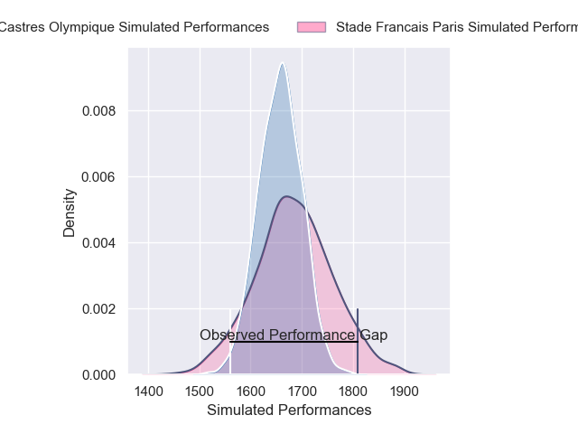
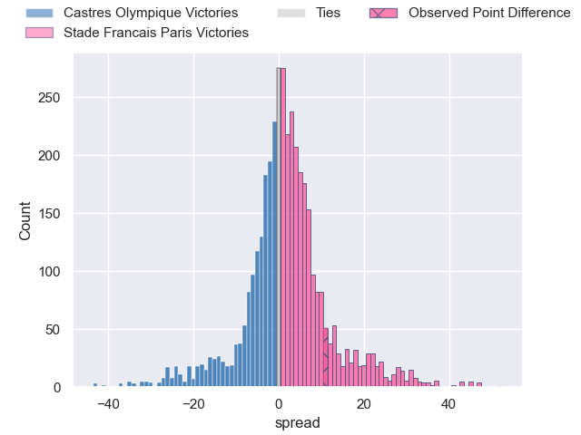
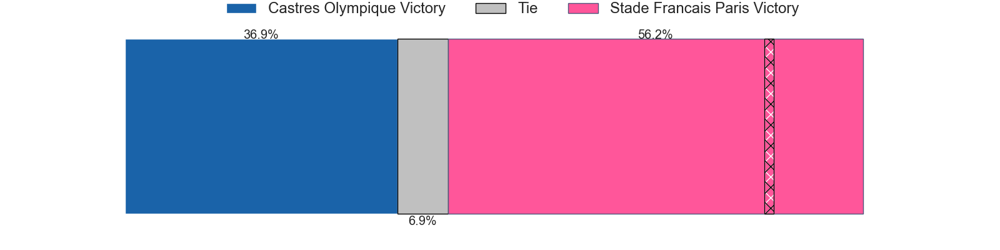
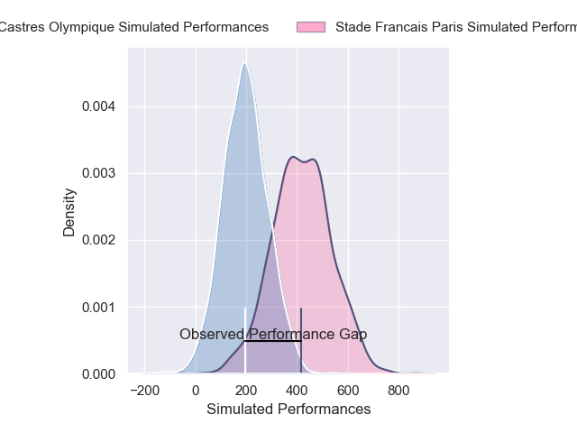
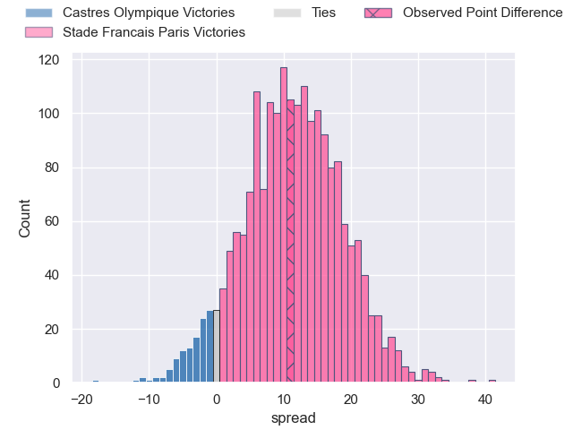
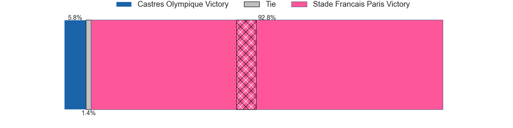

---  
layout: page  
title: Castres Olympique at Stade Francais Paris; 10-21  
date: 2025-06-07 18:00:00 -0500  
categories: "Top 14 Orange 24/25" match review  
---
# Castres Olympique at Stade Francais Paris; 10-21

# Club Level Predictions

The first set of predictions treats a club as the smallest object, as the club develops its members, organizes a gameplan, and deploys its players as needed for each match. This club model has a prediction of 0.543, which translates to predicting Stade Francais Paris to win by 1.5.

Our Over/Under is 45.5 - and combined with the spread above, we have a predicted scoreline of 22 to 23

Each club has a rating and a rating deviation (similar to a Glicko rating), and expected performances can be generated. This allows for simulated matches and spreads like the ones below.
## Projected Performances - Club Model

## Projected Spreads - Club Model

## Projected Results - Club Model

# Player Level Predictions

Treating teams instead as an entity made up of the currently active players, I have ratings for each player in an altogether different system. These can be combined to form team ratings once teamsheets are announced, weighting starters a bit higher than the reserves. After the match is played, players can be weighted by their minutes on the field, allowing for an accurate measure of the team's composition. With these compiled team ratings, we can make predictions, measure inaccuracy, and update the individual player ratings.
## Prediction without Player Minutes: Stade Francais Paris by 9.5

Castres Olympique by 5.7 on a neutral pitch

## Projected Performances - Player Model

## Projected Spreads - Player Model

## Projected Results - Player Model

|   Away Minutes | Away Player          |   Away Percentile |   Number |   Home Percentile | Home Player              |   Home Minutes |
|---------------:|:---------------------|------------------:|---------:|------------------:|:-------------------------|---------------:|
|             14 | Quentin Walcker      |             54.27 |        1 |             92.99 | Giorgi Melikidze         |             24 |
|             12 | Gaetan Barlot        |             80.04 |        2 |             97.18 | Giacomo Nicotera         |             32 |
|             40 | Nicolas Corato       |             34.95 |        3 |             80.14 | Paul Alo-Emile           |             32 |
|             22 | Guillaume Ducat      |             20.78 |        4 |              4.32 | Paul Gabrillagues        |             77 |
|             15 | Florent Vanverberghe |             87.97 |        5 |             72.47 | Baptiste Pesenti         |             70 |
|              0 | Mathieu Babillot     |             36.12 |        6 |             11.15 | Tanginoa Halaifonua      |             67 |
|             80 | Baptiste Delaporte   |             88.64 |        7 |             21.54 | Romain Briatte           |             80 |
|             40 | Abraham Papali'i     |             30.17 |        8 |              2.69 | Mathieu Hirigoyen        |             24 |
|             30 | Jeremy Fernandez     |             82.24 |        9 |             25.87 | Louis Foursans-Bourdette |             80 |
|              0 | Louis Le Brun        |             85.84 |       10 |             61.19 | Zack Henry               |             52 |
|             66 | Remy Baget           |             91.6  |       11 |             31.41 | Charles Laloi            |             40 |
|              8 | Adrien Seguret       |             19.37 |       12 |             90.15 | Julien Delbouis          |             45 |
|             48 | Vilimoni Botitu      |             64.55 |       13 |             65.57 | Jeremy Ward              |              0 |
|             48 | Nathanael Hulleu     |             77.73 |       14 |             76.89 | Joe Marchant             |             80 |
|             56 | Theo Chabouni        |             63.33 |       15 |             39.56 | Leo Barre                |             57 |
|             28 | Loris Zarantonello   |            nan    |       16 |              7.34 | Lucas Peyresblanques     |             41 |
|             80 | Antoine Tichit       |             84.37 |       17 |             24.98 | Isaac Koffi              |             80 |
|             20 | Leone Nakarawa       |             97.89 |       18 |             88.61 | Pierre-Henri Azagoh      |             65 |
|             28 | Yann Peysson         |             86.98 |       19 |             28.93 | Juan Martin Scelzo       |             16 |
|             40 | Santiago Arata       |             71.81 |       20 |             75.83 | Yoan Tanga               |             13 |
|             32 | Antoine Zeghdar      |            nan    |       21 |             34.17 | Thibaut Motassi          |             70 |
|              0 | Julien Dumora        |             68    |       22 |             13.13 | Samuel Ezeala            |             58 |
|             32 | Levan Chilachava     |             87.24 |       23 |             89.49 | Francisco Gomez Kodela   |             80 |

