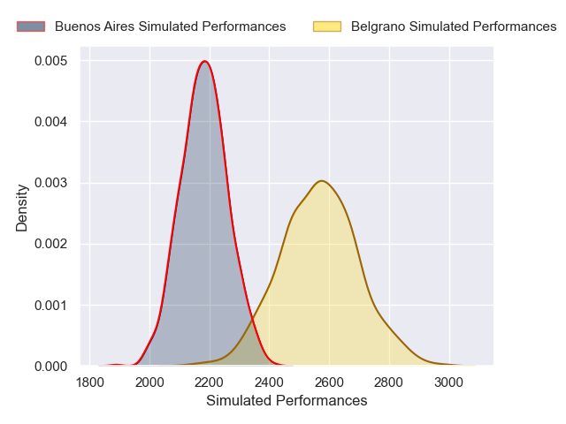
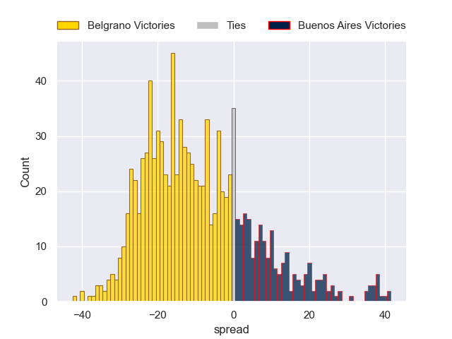

---  
layout: page  
title: Belgrano V Buenos Aires on 2025/06/28  
date: 2025-06-28  
categories: "URBA Top 12 2025" match projection  
---
# Belgrano V Buenos Aires on 2025/06/28, 41 to 32

# Club Level Predictions

Now that the game has been played, lets see how the club predictions did. I predicted Belgrano to win by 9.07, and Belgrano won by 9. That's an absolute error of 0.1 for the margin of victory, while my average absolute error has been 13.8 over the past six months. This prediction was more accurate than 99.5% of my recent predictions.

For the Over/Under model, I predicted a total of 56.5 and we have an actual total of 73. That's an absolute error of 16.5 compared to a six month average of 13.6. This prediction was more accurate than 31.8% of my recent predictions.
## Projected Performances - Club Model

## Projected Spreads - Club Model

## Projected Results - Club Model

