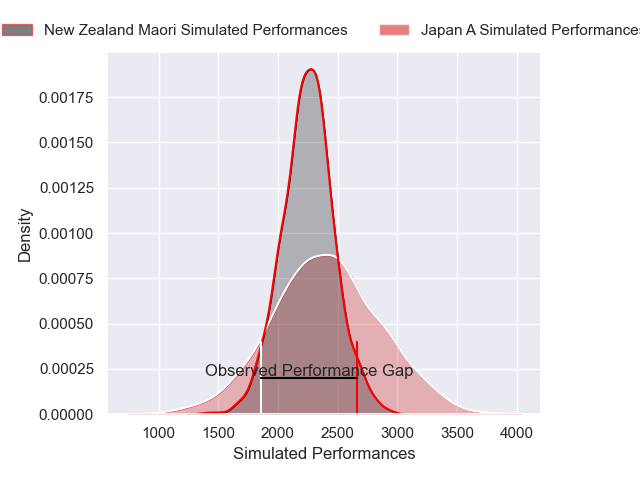
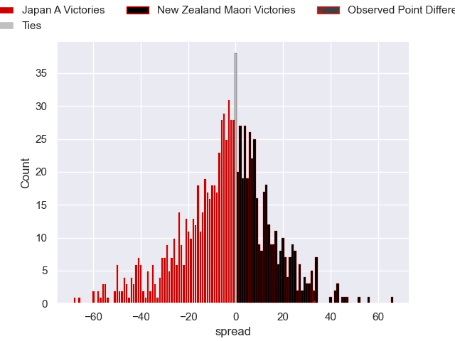

---  
layout: page  
title: Japan A V New Zealand Maori on 2025/06/28  
date: 2025-06-28  
categories: "International Test Match 2025" match projection  
---
# Japan A V New Zealand Maori on 2025/06/28, 20 to 53

# Club Level Predictions

Now that the game has been played, lets see how the club predictions did. I predicted Japan A to win by 3.5, and New Zealand Maori won by 33. That's an absolute error of 36.5 for the margin of victory, while my average absolute error has been 13.8 over the past six months. This prediction was more accurate than 6.1% of my recent predictions.

For the Over/Under model, I predicted a total of 47.5 and we have an actual total of 73. That's an absolute error of 25.5 compared to a six month average of 13.6. This prediction was more accurate than 14.2% of my recent predictions.
## Projected Performances - Club Model

## Projected Spreads - Club Model

## Projected Results - Club Model

