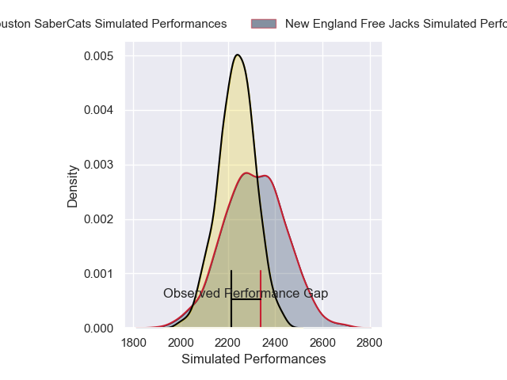
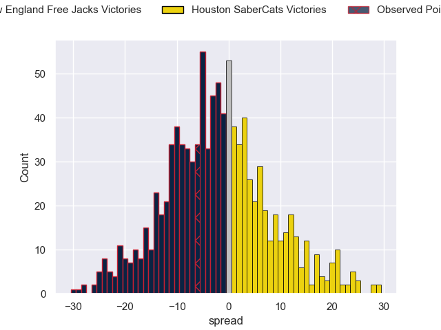

---  
layout: page  
title: New England Free Jacks V Houston SaberCats on 2025/06/28  
date: 2025-06-28  
categories: "Major League Rugby 2025" match projection  
---
# New England Free Jacks V Houston SaberCats on 2025/06/28, 28 to 22

# Club Level Predictions

Now that the game has been played, lets see how the club predictions did. I predicted New England Free Jacks to win by 2.25, and New England Free Jacks won by 6. That's an absolute error of 3.8 for the margin of victory, while my average absolute error has been 13.8 over the past six months. This prediction was more accurate than 80.8% of my recent predictions.

For the Over/Under model, I predicted a total of 48.5 and we have an actual total of 50. That's an absolute error of 1.5 compared to a six month average of 13.6. This prediction was more accurate than 92.2% of my recent predictions.
## Projected Performances - Club Model

## Projected Spreads - Club Model

## Projected Results - Club Model

