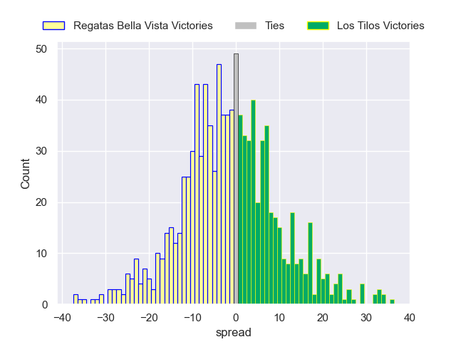

---  
layout: page  
title: Regatas Bella Vista V Los Tilos on 2025/06/28  
date: 2025-06-28  
categories: "URBA Top 12 2025" match projection  
---
# Regatas Bella Vista V Los Tilos on 2025/06/28, 20 to 13

# Club Level Predictions

Now that the game has been played, lets see how the club predictions did. I predicted Los Tilos to win by 0.5, and Regatas Bella Vista won by 7. That's an absolute error of 7.5 for the margin of victory, while my average absolute error has been 13.8 over the past six months. This prediction was more accurate than 63.2% of my recent predictions.

For the Over/Under model, I predicted a total of 47.5 and we have an actual total of 33. That's an absolute error of 14.5 compared to a six month average of 13.6. This prediction was more accurate than 36.3% of my recent predictions.
## Projected Performances - Club Model

## Projected Spreads - Club Model

## Projected Results - Club Model

