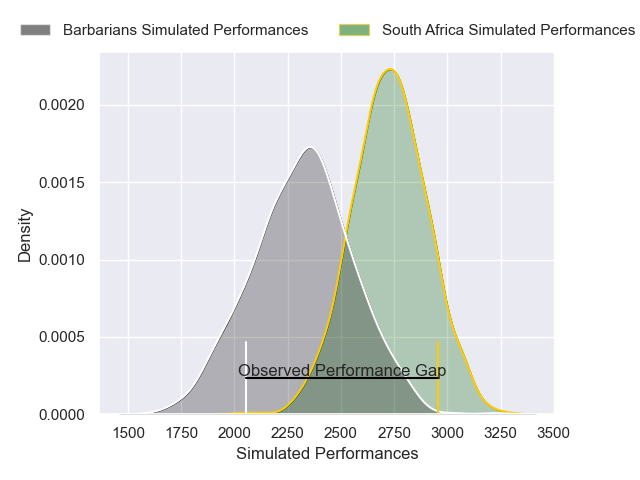
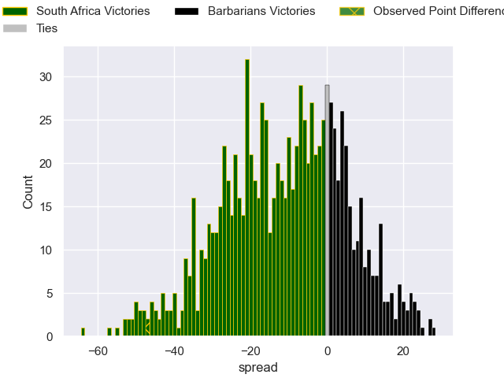

---  
layout: page  
title: South Africa V Barbarians on 2025/06/28  
date: 2025-06-28  
categories: "International Test Match 2025" match projection  
---
# South Africa V Barbarians on 2025/06/28, 54 to 7

# Club Level Predictions

Now that the game has been played, lets see how the club predictions did. I predicted South Africa to win by 10.82, and South Africa won by 47. That's an absolute error of 36.2 for the margin of victory, while my average absolute error has been 13.8 over the past six months. This prediction was more accurate than 6.2% of my recent predictions.

For the Over/Under model, I predicted a total of 54.5 and we have an actual total of 61. That's an absolute error of 6.5 compared to a six month average of 13.6. This prediction was more accurate than 71.0% of my recent predictions.
## Projected Performances - Club Model

## Projected Spreads - Club Model

## Projected Results - Club Model

