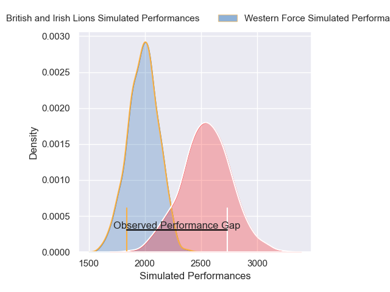
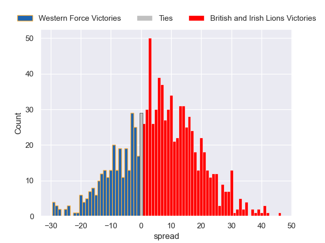
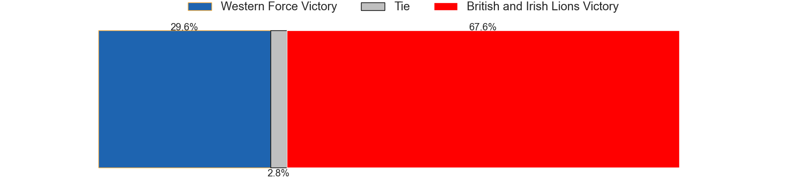

---  
layout: page  
title: Western Force V British and Irish Lions on 2025/06/28  
date: 2025-06-28  
categories: "Lions Tour 2025" match projection  
---
# Western Force V British and Irish Lions on 2025/06/28, 7 to 54

# Club Level Predictions

Now that the game has been played, lets see how the club predictions did. I predicted British and Irish Lions to win by 15.02, and British and Irish Lions won by 47. That's an absolute error of 32.0 for the margin of victory, while my average absolute error has been 13.8 over the past six months. This prediction was more accurate than 7.3% of my recent predictions.

For the Over/Under model, I predicted a total of 55.5 and we have an actual total of 61. That's an absolute error of 5.5 compared to a six month average of 13.6. This prediction was more accurate than 75.5% of my recent predictions.
## Projected Performances - Club Model

## Projected Spreads - Club Model

## Projected Results - Club Model

