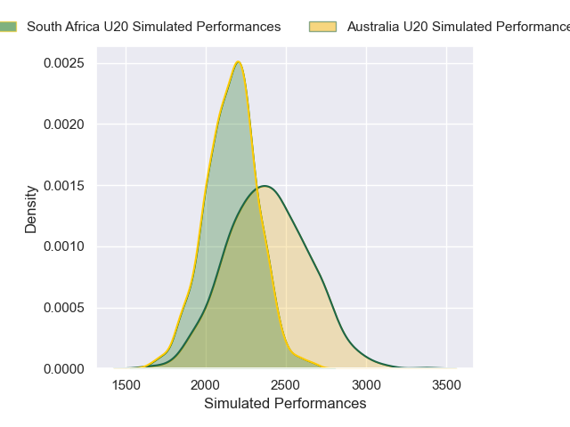
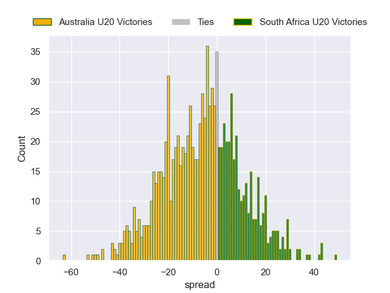

---  
layout: page  
title: Australia U20 V South Africa U20 on 2025/06/29  
date: 2025-06-29  
categories: "U20 Championship 2025" match projection  
---
# Australia U20 V South Africa U20 on 2025/06/29, 17 to 73

# Club Level Predictions

Now that the game has been played, lets see how the club predictions did. I predicted Australia U20 to win by 6.46, and South Africa U20 won by 56. That's an absolute error of 62.5 for the margin of victory, while my average absolute error has been 13.8 over the past six months. This prediction was more accurate than 1.0% of my recent predictions.

For the Over/Under model, I predicted a total of 55.5 and we have an actual total of 90. That's an absolute error of 34.5 compared to a six month average of 13.6. This prediction was more accurate than 5.1% of my recent predictions.
## Projected Performances - Club Model

## Projected Spreads - Club Model

## Projected Results - Club Model

