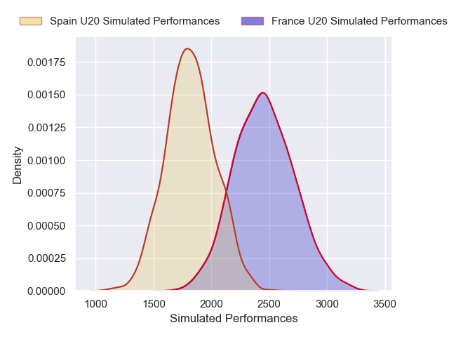
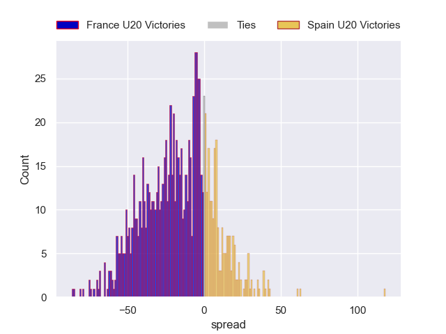
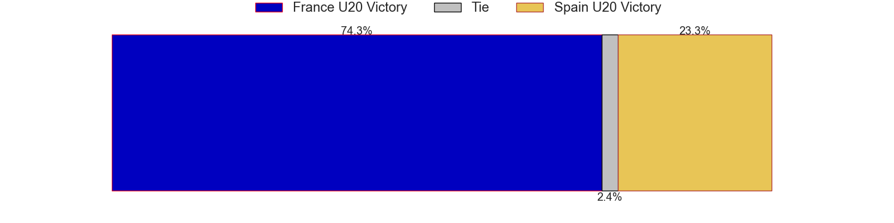

---  
layout: page  
title: France U20 V Spain U20 on 2025/06/29  
date: 2025-06-29  
categories: "U20 Championship 2025" match projection  
---
# France U20 V Spain U20 on 2025/06/29, 49 to 11

# Club Level Predictions

Now that the game has been played, lets see how the club predictions did. I predicted France U20 to win by 17.17, and France U20 won by 38. That's an absolute error of 20.8 for the margin of victory, while my average absolute error has been 13.8 over the past six months. This prediction was more accurate than 21.2% of my recent predictions.

For the Over/Under model, I predicted a total of 67.5 and we have an actual total of 60. That's an absolute error of 7.5 compared to a six month average of 13.6. This prediction was more accurate than 65.7% of my recent predictions.
## Projected Performances - Club Model

## Projected Spreads - Club Model

## Projected Results - Club Model

