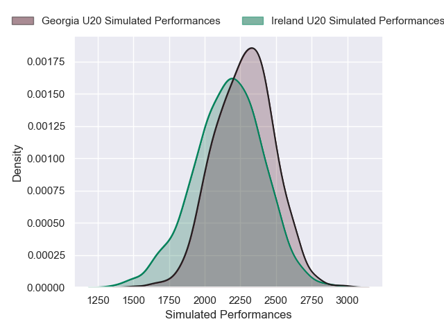
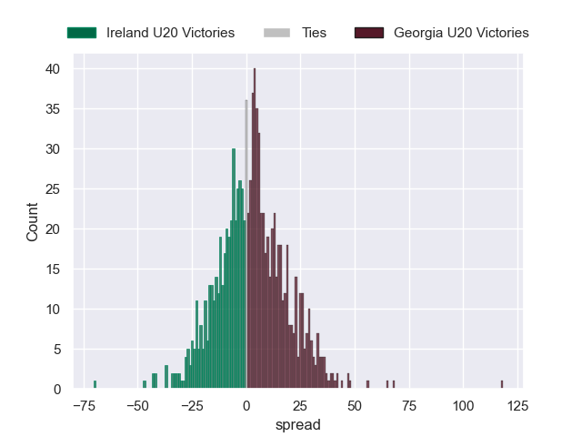

---  
layout: page  
title: Ireland U20 V Georgia U20 on 2025/06/29  
date: 2025-06-29  
categories: "U20 Championship 2025" match projection  
---
# Ireland U20 V Georgia U20 on 2025/06/29, 35 to 28

# Club Level Predictions

Now that the game has been played, lets see how the club predictions did. I predicted Georgia U20 to win by 3.82, and Ireland U20 won by 7. That's an absolute error of 10.8 for the margin of victory, while my average absolute error has been 13.8 over the past six months. This prediction was more accurate than 48.2% of my recent predictions.

For the Over/Under model, I predicted a total of 38.5 and we have an actual total of 63. That's an absolute error of 24.5 compared to a six month average of 13.6. This prediction was more accurate than 15.6% of my recent predictions.
## Projected Performances - Club Model

## Projected Spreads - Club Model

## Projected Results - Club Model

