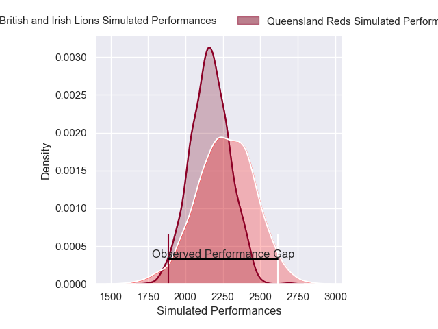
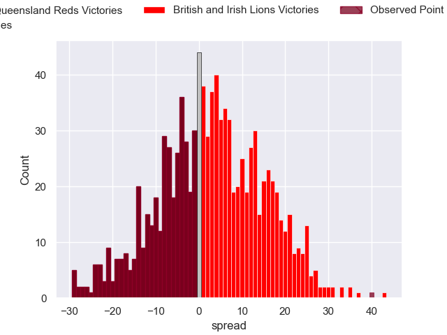

---  
layout: page  
title: Queensland Reds V British and Irish Lions on 2025/07/02  
date: 2025-07-02  
categories: "Lions Tour 2025" match projection  
---
# Queensland Reds V British and Irish Lions on 2025/07/02, 12.0 to 52.0

# Club Level Predictions

Now that the game has been played, lets see how the club predictions did. I predicted British and Irish Lions to win by 6.43, and British and Irish Lions won by 40.0. That's an absolute error of 33.6 for the margin of victory, while my average absolute error has been 13.8 over the past six months. This prediction was more accurate than 6.9% of my recent predictions.

For the Over/Under model, I predicted a total of 48.5 and we have an actual total of 64.0. That's an absolute error of 15.5 compared to a six month average of 13.6. This prediction was more accurate than 33.8% of my recent predictions.
## Projected Performances - Club Model

## Projected Spreads - Club Model

## Projected Results - Club Model

