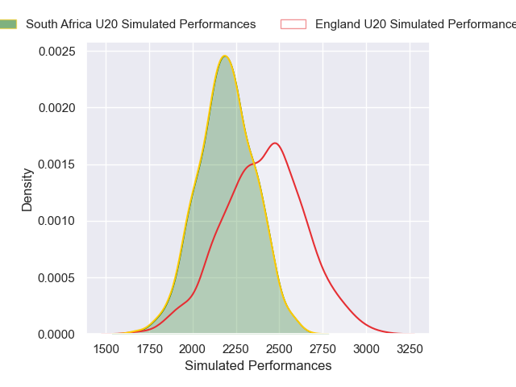
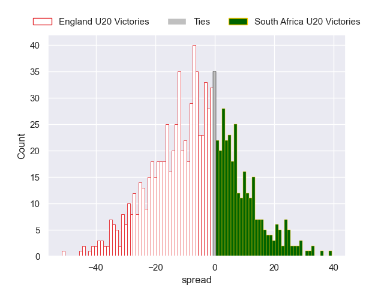

---  
layout: page  
title: England U20 V South Africa U20 on 2025/07/04  
date: 2025-07-04  
categories: "U20 Championship 2025" match projection  
---
# England U20 V South Africa U20 on 2025/07/04, 22.0 to 32.0

# Club Level Predictions

Now that the game has been played, lets see how the club predictions did. I predicted England U20 to win by 4.12, and South Africa U20 won by 10.0. That's an absolute error of 14.1 for the margin of victory, while my average absolute error has been 13.8 over the past six months. This prediction was more accurate than 37.5% of my recent predictions.

For the Over/Under model, I predicted a total of 55.5 and we have an actual total of 54.0. That's an absolute error of 1.5 compared to a six month average of 13.6. This prediction was more accurate than 92.2% of my recent predictions.
## Projected Performances - Club Model

## Projected Spreads - Club Model

## Projected Results - Club Model

