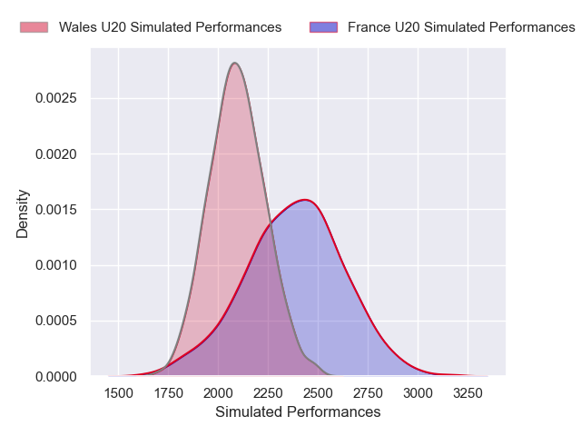
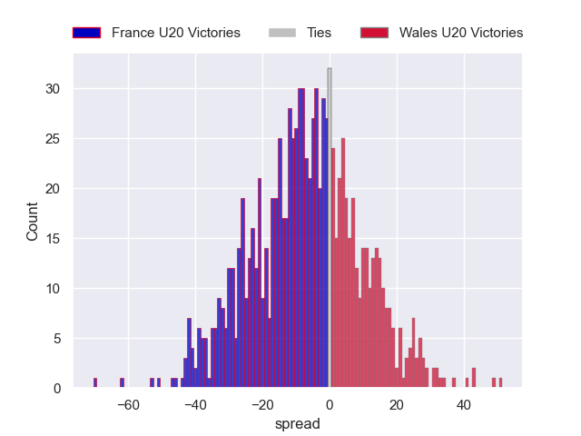
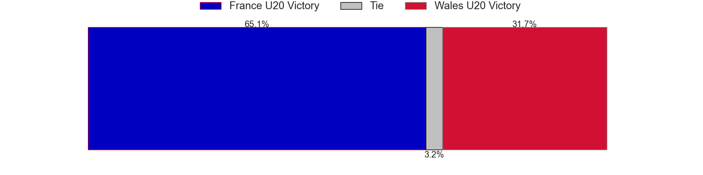

---  
layout: page  
title: France U20 V Wales U20 on 2025/07/04  
date: 2025-07-04  
categories: "U20 Championship 2025" match projection  
---
# France U20 V Wales U20 on 2025/07/04, 35.0 to 21.0

# Club Level Predictions

Now that the game has been played, lets see how the club predictions did. I predicted France U20 to win by 8.99, and France U20 won by 14.0. That's an absolute error of 5.0 for the margin of victory, while my average absolute error has been 13.8 over the past six months. This prediction was more accurate than 74.2% of my recent predictions.

For the Over/Under model, I predicted a total of 59.5 and we have an actual total of 56.0. That's an absolute error of 3.5 compared to a six month average of 13.6. This prediction was more accurate than 84.0% of my recent predictions.
## Projected Performances - Club Model

## Projected Spreads - Club Model

## Projected Results - Club Model

