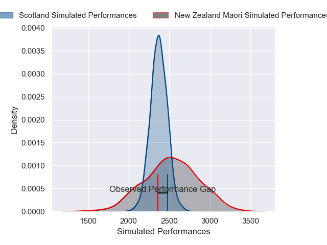
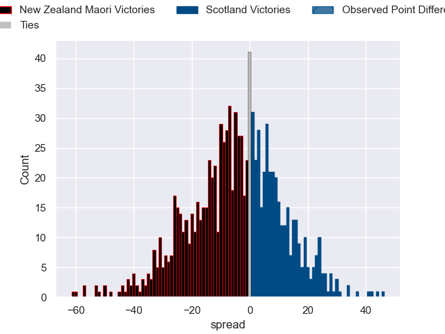

---  
layout: page  
title: New Zealand Maori V Scotland on 2025/07/04  
date: 2025-07-04  
categories: "International Test Match 2025" match projection  
---
# New Zealand Maori V Scotland on 2025/07/04, 26 to 29

# Club Level Predictions

Now that the game has been played, lets see how the club predictions did. I predicted New Zealand Maori to win by 4.86, and Scotland won by 3. That's an absolute error of 7.9 for the margin of victory, while my average absolute error has been 13.8 over the past six months. This prediction was more accurate than 61.2% of my recent predictions.

For the Over/Under model, I predicted a total of 46.5 and we have an actual total of 55. That's an absolute error of 8.5 compared to a six month average of 13.6. This prediction was more accurate than 60.0% of my recent predictions.
## Projected Performances - Club Model

## Projected Spreads - Club Model

## Projected Results - Club Model

