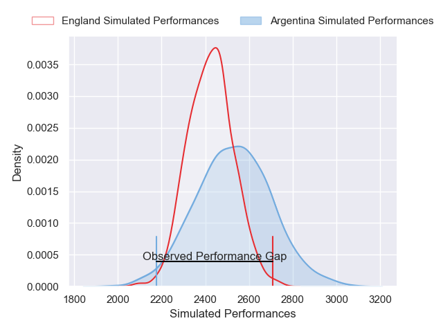
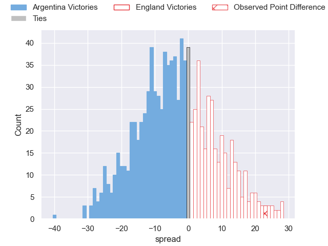

---  
layout: page  
title: Argentina V England on 2025/07/05  
date: 2025-07-05  
categories: "International Test Match 2025" match projection  
---
# Argentina V England on 2025/07/05, 12.0 to 35.0

# Club Level Predictions

Now that the game has been played, lets see how the club predictions did. I predicted Argentina to win by 3.0, and England won by 23.0. That's an absolute error of 26.0 for the margin of victory, while my average absolute error has been 13.8 over the past six months. This prediction was more accurate than 12.4% of my recent predictions.

For the Over/Under model, I predicted a total of 53.5 and we have an actual total of 47.0. That's an absolute error of 6.5 compared to a six month average of 13.6. This prediction was more accurate than 71.0% of my recent predictions.
## Projected Performances - Club Model

## Projected Spreads - Club Model

## Projected Results - Club Model

