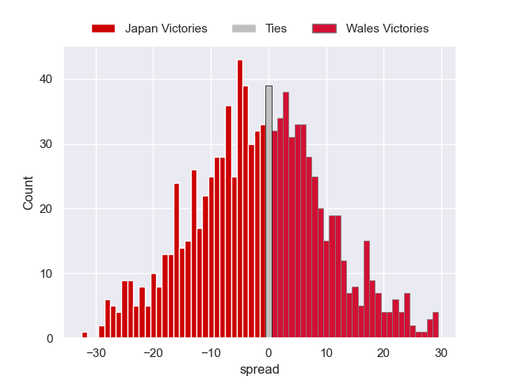

---  
layout: page  
title: Japan V Wales on 2025/07/05  
date: 2025-07-05  
categories: "International Test Match 2025" match projection  
---
# Japan V Wales on 2025/07/05, 24 to 19

# Club Level Predictions

Now that the game has been played, lets see how the club predictions did. I predicted Japan to win by 1.81, and Japan won by 5. That's an absolute error of 3.2 for the margin of victory, while my average absolute error has been 13.8 over the past six months. This prediction was more accurate than 83.7% of my recent predictions.

For the Over/Under model, I predicted a total of 55.5 and we have an actual total of 43. That's an absolute error of 12.5 compared to a six month average of 13.6. This prediction was more accurate than 44.2% of my recent predictions.
## Projected Performances - Club Model

## Projected Spreads - Club Model

## Projected Results - Club Model

