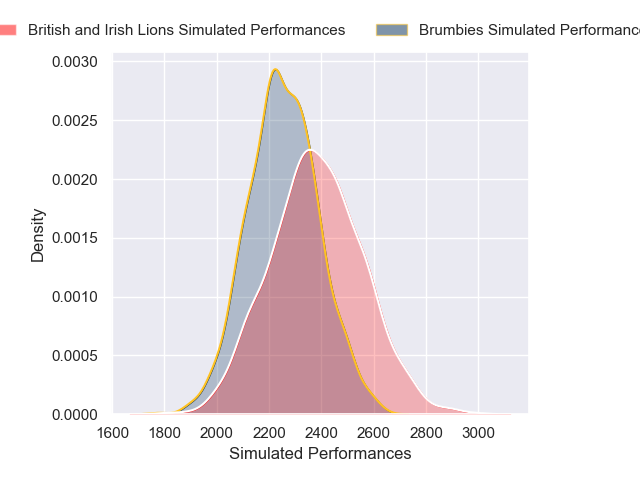
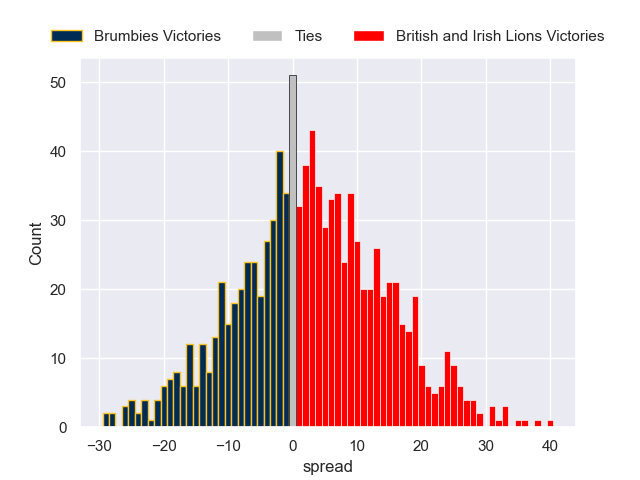

---  
layout: page  
title: Brumbies V British and Irish Lions on 2025/07/09  
date: 2025-07-09  
categories: "Lions Tour 2025" match projection  
---
# Brumbies V British and Irish Lions on 2025/07/09, 24.0 to 36.0

# Club Level Predictions

Now that the game has been played, lets see how the club predictions did. I predicted British and Irish Lions to win by 4.16, and British and Irish Lions won by 12.0. That's an absolute error of 7.8 for the margin of victory, while my average absolute error has been 13.8 over the past six months. This prediction was more accurate than 61.3% of my recent predictions.

For the Over/Under model, I predicted a total of 51.5 and we have an actual total of 60.0. That's an absolute error of 8.5 compared to a six month average of 13.6. This prediction was more accurate than 60.0% of my recent predictions.
## Projected Performances - Club Model

## Projected Spreads - Club Model

## Projected Results - Club Model

