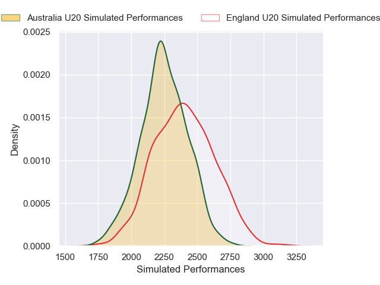
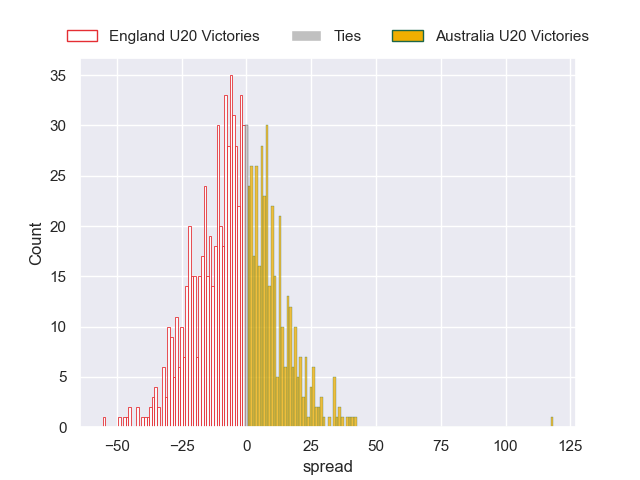

---  
layout: page  
title: England U20 V Australia U20 on 2025/07/09  
date: 2025-07-09  
categories: "U20 Championship 2025" match projection  
---
# England U20 V Australia U20 on 2025/07/09, 36.0 to 33.0

# Club Level Predictions

Now that the game has been played, lets see how the club predictions did. I predicted England U20 to win by 9.5, and England U20 won by 3.0. That's an absolute error of 6.5 for the margin of victory, while my average absolute error has been 13.8 over the past six months. This prediction was more accurate than 67.9% of my recent predictions.

For the Over/Under model, I predicted a total of 58.5 and we have an actual total of 69.0. That's an absolute error of 10.5 compared to a six month average of 13.6. This prediction was more accurate than 52.4% of my recent predictions.
## Projected Performances - Club Model

## Projected Spreads - Club Model

## Projected Results - Club Model

