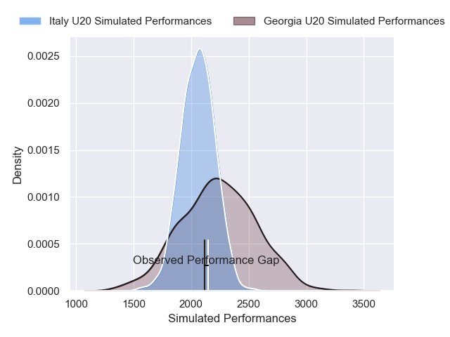
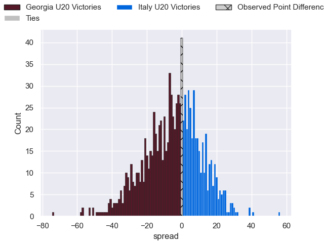

---  
layout: page  
title: Georgia U20 V Italy U20 on 2025/07/09  
date: 2025-07-09  
categories: "U20 Championship 2025" match projection  
---
# Georgia U20 V Italy U20 on 2025/07/09, 19.0 to 19.0

# Club Level Predictions

Now that the game has been played, lets see how the club predictions did. I predicted Georgia U20 to win by 5.04, and Italy U20 won by 0.0. That's an absolute error of 5.0 for the margin of victory, while my average absolute error has been 13.7 over the past six months. This prediction was more accurate than 74.0% of my recent predictions.

For the Over/Under model, I predicted a total of 44.5 and we have an actual total of 38.0. That's an absolute error of 6.5 compared to a six month average of 13.9. This prediction was more accurate than 71.5% of my recent predictions.
## Projected Performances - Club Model

## Projected Spreads - Club Model

## Projected Results - Club Model

