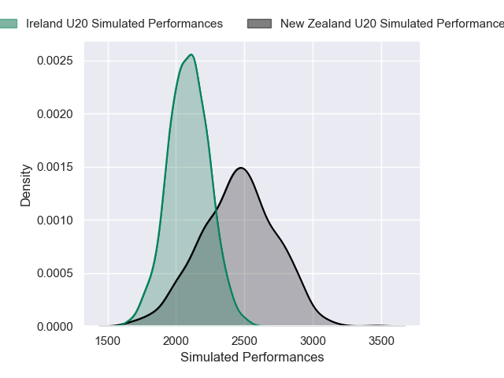
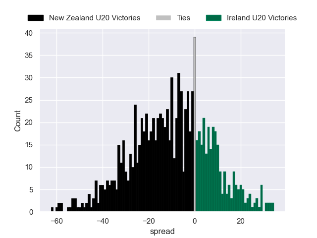

---  
layout: page  
title: New Zealand U20 V Ireland U20 on 2025/07/09  
date: 2025-07-09  
categories: "U20 Championship 2025" match projection  
---
# New Zealand U20 V Ireland U20 on 2025/07/09, 69.0 to 22.0

# Club Level Predictions

Now that the game has been played, lets see how the club predictions did. I predicted New Zealand U20 to win by 8.0, and New Zealand U20 won by 47.0. That's an absolute error of 39.0 for the margin of victory, while my average absolute error has been 13.7 over the past six months. This prediction was more accurate than 4.7% of my recent predictions.

For the Over/Under model, I predicted a total of 49.5 and we have an actual total of 91.0. That's an absolute error of 41.5 compared to a six month average of 13.9. This prediction was more accurate than 3.0% of my recent predictions.
## Projected Performances - Club Model

## Projected Spreads - Club Model

## Projected Results - Club Model

