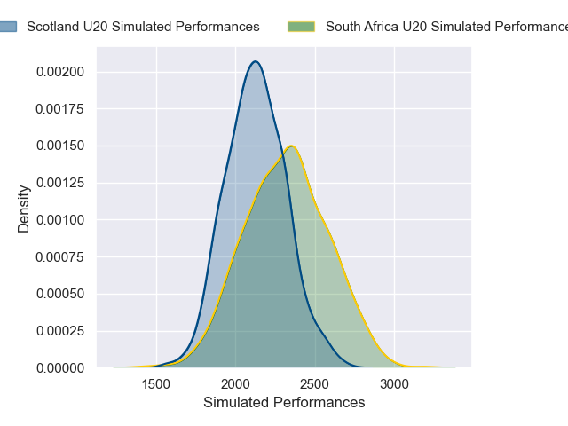
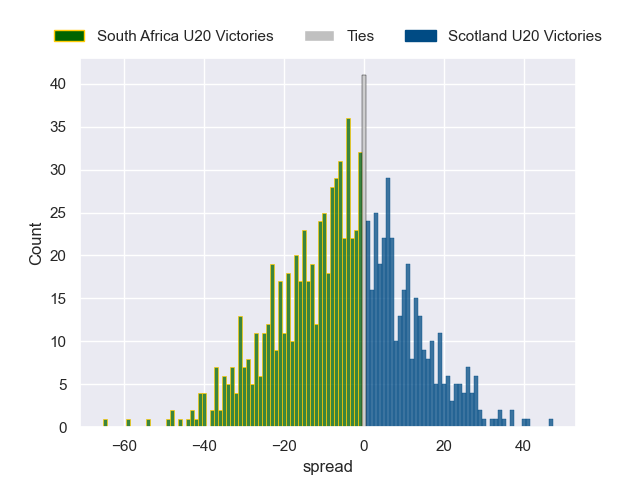

---  
layout: page  
title: South Africa U20 V Scotland U20 on 2025/07/09  
date: 2025-07-09  
categories: "U20 Championship 2025" match projection  
---
# South Africa U20 V Scotland U20 on 2025/07/09, 73.0 to 14.0

# Club Level Predictions

Now that the game has been played, lets see how the club predictions did. I predicted South Africa U20 to win by 10.2, and South Africa U20 won by 59.0. That's an absolute error of 48.8 for the margin of victory, while my average absolute error has been 13.8 over the past six months. This prediction was more accurate than 2.2% of my recent predictions.

For the Over/Under model, I predicted a total of 59.5 and we have an actual total of 87.0. That's an absolute error of 27.5 compared to a six month average of 13.6. This prediction was more accurate than 11.2% of my recent predictions.
## Projected Performances - Club Model

## Projected Spreads - Club Model

## Projected Results - Club Model

