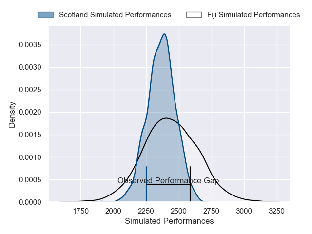
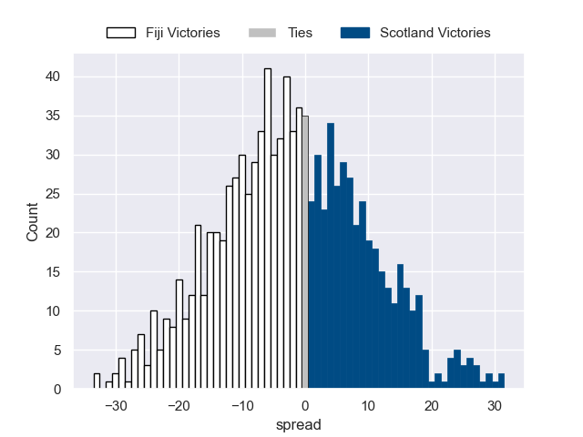

---  
layout: page  
title: Fiji V Scotland on 2025/07/11  
date: 2025-07-11  
categories: "International Test Match 2025" match projection  
---
# Fiji V Scotland on 2025/07/11, 29.0 to 14.0

# Club Level Predictions

Now that the game has been played, lets see how the club predictions did. I predicted Fiji to win by 1.75, and Fiji won by 15.0. That's an absolute error of 13.2 for the margin of victory, while my average absolute error has been 13.7 over the past six months. This prediction was more accurate than 40.8% of my recent predictions.

For the Over/Under model, I predicted a total of 46.5 and we have an actual total of 43.0. That's an absolute error of 3.5 compared to a six month average of 13.9. This prediction was more accurate than 84.5% of my recent predictions.
## Projected Performances - Club Model

## Projected Spreads - Club Model

## Projected Results - Club Model

