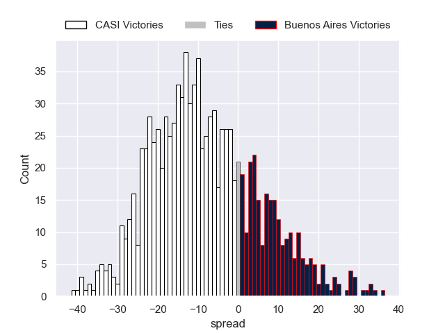
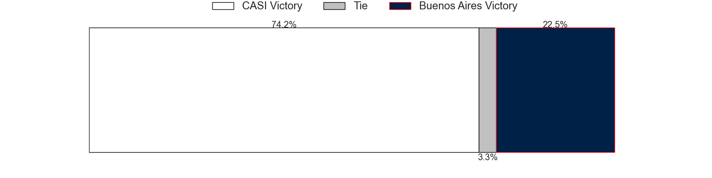

---  
layout: page  
title: CASI V Buenos Aires on 2025/07/12  
date: 2025-07-12  
categories: "URBA Top 12 2025" match projection  
---
# CASI V Buenos Aires on 2025/07/12, 55.0 to 15.0

# Club Level Predictions

Now that the game has been played, lets see how the club predictions did. I predicted CASI to win by 8.31, and CASI won by 40.0. That's an absolute error of 31.7 for the margin of victory, while my average absolute error has been 13.7 over the past six months. This prediction was more accurate than 6.9% of my recent predictions.

For the Over/Under model, I predicted a total of 54.5 and we have an actual total of 70.0. That's an absolute error of 15.5 compared to a six month average of 13.9. This prediction was more accurate than 33.9% of my recent predictions.
## Projected Performances - Club Model

## Projected Spreads - Club Model

## Projected Results - Club Model

