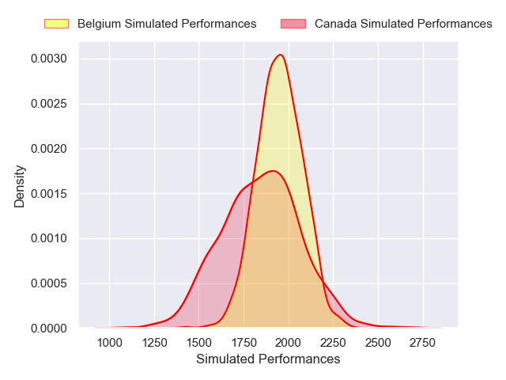
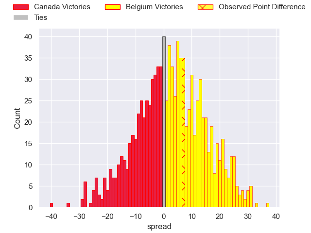

---  
layout: page  
title: Canada V Belgium on 2025/07/12  
date: 2025-07-12  
categories: "International Test Match 2025" match projection  
---
# Canada V Belgium on 2025/07/12, 18.0 to 25.0

# Club Level Predictions

Now that the game has been played, lets see how the club predictions did. I predicted Belgium to win by 2.68, and Belgium won by 7.0. That's an absolute error of 4.3 for the margin of victory, while my average absolute error has been 13.8 over the past six months. This prediction was more accurate than 77.9% of my recent predictions.

For the Over/Under model, I predicted a total of 56.5 and we have an actual total of 43.0. That's an absolute error of 13.5 compared to a six month average of 13.6. This prediction was more accurate than 40.0% of my recent predictions.
## Projected Performances - Club Model

## Projected Spreads - Club Model

## Projected Results - Club Model

