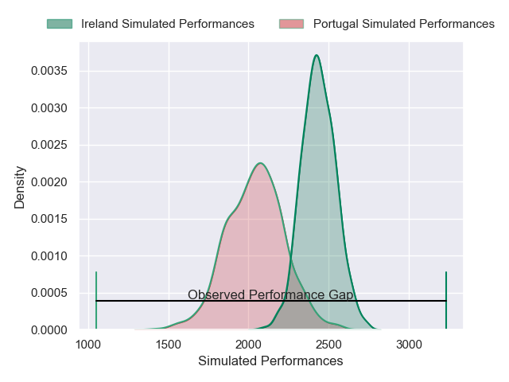
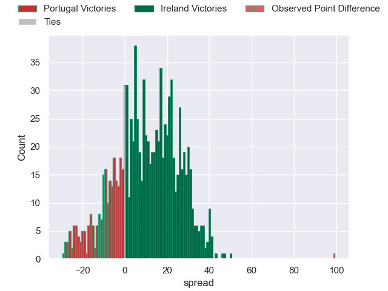

---  
layout: page  
title: Portugal V Ireland on 2025/07/12  
date: 2025-07-12  
categories: "International Test Match 2025" match projection  
---
# Portugal V Ireland on 2025/07/12, 7.0 to 106.0

# Club Level Predictions

Now that the game has been played, lets see how the club predictions did. I predicted Ireland to win by 10.12, and Ireland won by 99.0. That's an absolute error of 88.9 for the margin of victory, while my average absolute error has been 13.8 over the past six months. This prediction was more accurate than 0.2% of my recent predictions.

For the Over/Under model, I predicted a total of 58.5 and we have an actual total of 113.0. That's an absolute error of 54.5 compared to a six month average of 13.6. This prediction was more accurate than 0.7% of my recent predictions.
## Projected Performances - Club Model

## Projected Spreads - Club Model

## Projected Results - Club Model

