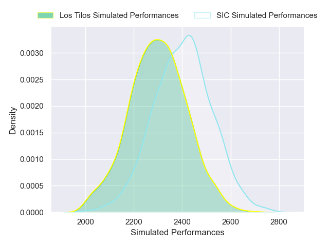
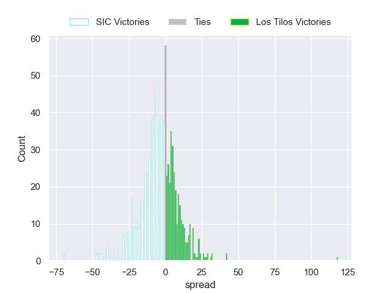
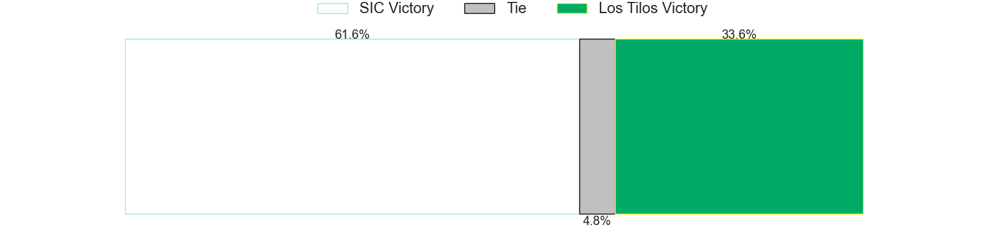

---  
layout: page  
title: SIC V Los Tilos on 2025/07/12  
date: 2025-07-12  
categories: "URBA Top 12 2025" match projection  
---
# SIC V Los Tilos on 2025/07/12, 28.0 to 16.0

# Club Level Predictions

Now that the game has been played, lets see how the club predictions did. I predicted SIC to win by 5.76, and SIC won by 12.0. That's an absolute error of 6.2 for the margin of victory, while my average absolute error has been 13.7 over the past six months. This prediction was more accurate than 69.8% of my recent predictions.

For the Over/Under model, I predicted a total of 48.5 and we have an actual total of 44.0. That's an absolute error of 4.5 compared to a six month average of 13.9. This prediction was more accurate than 80.2% of my recent predictions.
## Projected Performances - Club Model

## Projected Spreads - Club Model

## Projected Results - Club Model

