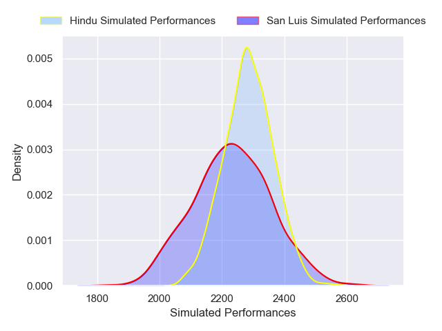
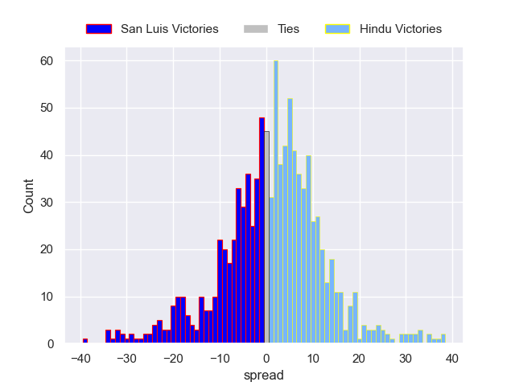

---  
layout: page  
title: San Luis V Hindu on 2025/07/12  
date: 2025-07-12  
categories: "URBA Top 12 2025" match projection  
---
# San Luis V Hindu on 2025/07/12, 3.0 to 55.0

# Club Level Predictions

Now that the game has been played, lets see how the club predictions did. I predicted Hindu to win by 1.16, and Hindu won by 52.0. That's an absolute error of 50.8 for the margin of victory, while my average absolute error has been 13.7 over the past six months. This prediction was more accurate than 1.8% of my recent predictions.

For the Over/Under model, I predicted a total of 50.5 and we have an actual total of 58.0. That's an absolute error of 7.5 compared to a six month average of 13.9. This prediction was more accurate than 66.8% of my recent predictions.
## Projected Performances - Club Model

## Projected Spreads - Club Model

## Projected Results - Club Model

