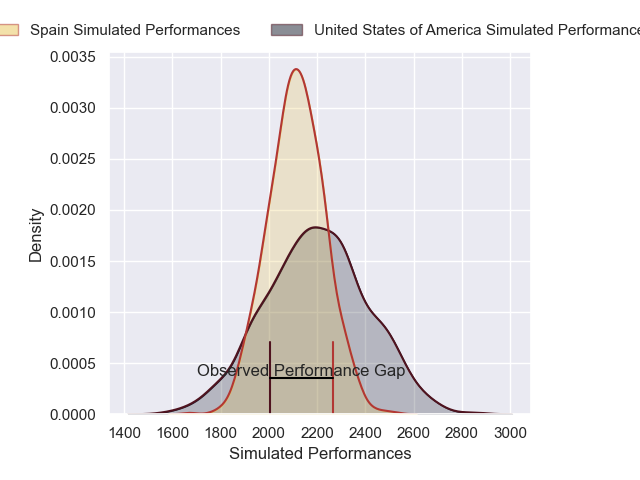

---  
layout: page  
title: United States of America V Spain on 2025/07/12  
date: 2025-07-12  
categories: "International Test Match 2025" match projection  
---
# United States of America V Spain on 2025/07/12, 20.0 to 31.0

# Club Level Predictions

Now that the game has been played, lets see how the club predictions did. I predicted United States of America to win by 2.21, and Spain won by 11.0. That's an absolute error of 13.2 for the margin of victory, while my average absolute error has been 13.7 over the past six months. This prediction was more accurate than 41.2% of my recent predictions.

For the Over/Under model, I predicted a total of 55.5 and we have an actual total of 51.0. That's an absolute error of 4.5 compared to a six month average of 13.9. This prediction was more accurate than 80.2% of my recent predictions.
## Projected Performances - Club Model

## Projected Spreads - Club Model

## Projected Results - Club Model

