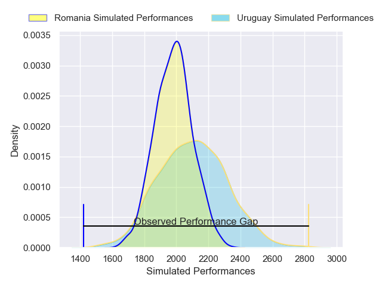
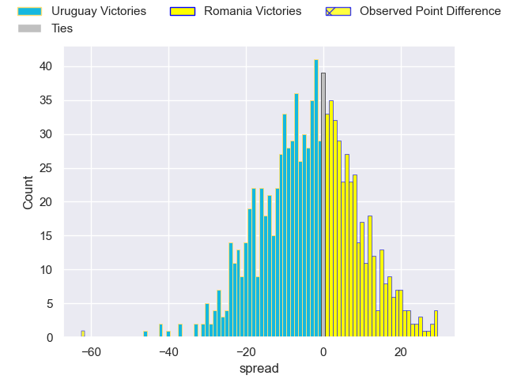

---  
layout: page  
title: Uruguay V Romania on 2025/07/12  
date: 2025-07-12  
categories: "International Test Match 2025" match projection  
---
# Uruguay V Romania on 2025/07/12, 70.0 to 8.0

# Club Level Predictions

Now that the game has been played, lets see how the club predictions did. I predicted Uruguay to win by 3.47, and Uruguay won by 62.0. That's an absolute error of 58.5 for the margin of victory, while my average absolute error has been 13.7 over the past six months. This prediction was more accurate than 1.0% of my recent predictions.

For the Over/Under model, I predicted a total of 50.5 and we have an actual total of 78.0. That's an absolute error of 27.5 compared to a six month average of 13.9. This prediction was more accurate than 11.6% of my recent predictions.
## Projected Performances - Club Model

## Projected Spreads - Club Model

## Projected Results - Club Model

