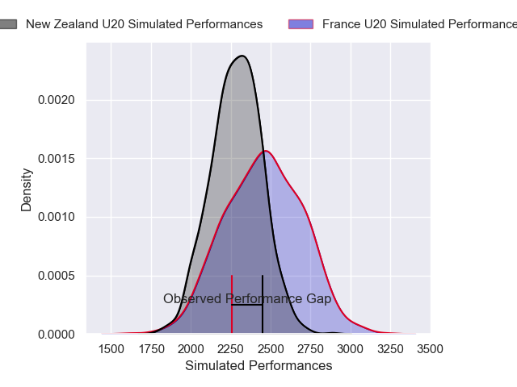
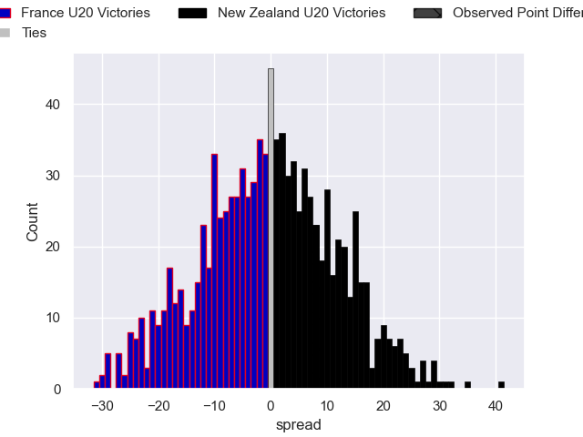

---  
layout: page  
title: France U20 V New Zealand U20 on 2025/07/14  
date: 2025-07-14  
categories: "U20 Championship 2025" match projection  
---
# France U20 V New Zealand U20 on 2025/07/14, 26.0 to 34.0

# Club Level Predictions

Now that the game has been played, lets see how the club predictions did. I predicted France U20 to win by 4.0, and New Zealand U20 won by 8.0. That's an absolute error of 12.0 for the margin of victory, while my average absolute error has been 13.7 over the past six months. This prediction was more accurate than 44.7% of my recent predictions.

For the Over/Under model, I predicted a total of 54.5 and we have an actual total of 60.0. That's an absolute error of 5.5 compared to a six month average of 13.9. This prediction was more accurate than 76.2% of my recent predictions.
## Projected Performances - Club Model

## Projected Spreads - Club Model

## Projected Results - Club Model

