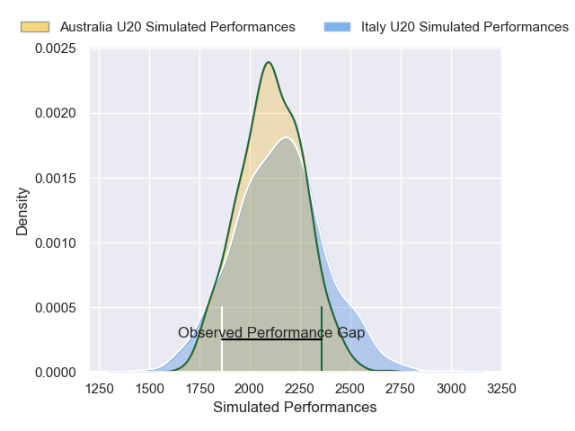
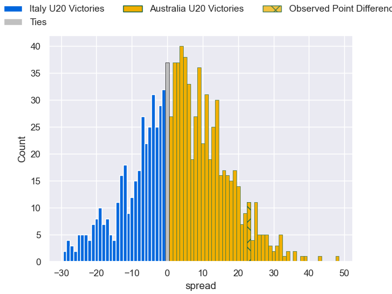

---  
layout: page  
title: Italy U20 V Australia U20 on 2025/07/14  
date: 2025-07-14  
categories: "U20 Championship 2025" match projection  
---
# Italy U20 V Australia U20 on 2025/07/14, 21.0 to 44.0

# Club Level Predictions

Now that the game has been played, lets see how the club predictions did. I predicted Australia U20 to win by 3.29, and Australia U20 won by 23.0. That's an absolute error of 19.7 for the margin of victory, while my average absolute error has been 13.6 over the past six months. This prediction was more accurate than 22.7% of my recent predictions.

For the Over/Under model, I predicted a total of 54.5 and we have an actual total of 65.0. That's an absolute error of 10.5 compared to a six month average of 13.9. This prediction was more accurate than 52.2% of my recent predictions.
## Projected Performances - Club Model

## Projected Spreads - Club Model

## Projected Results - Club Model

