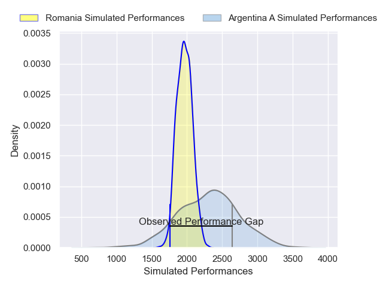
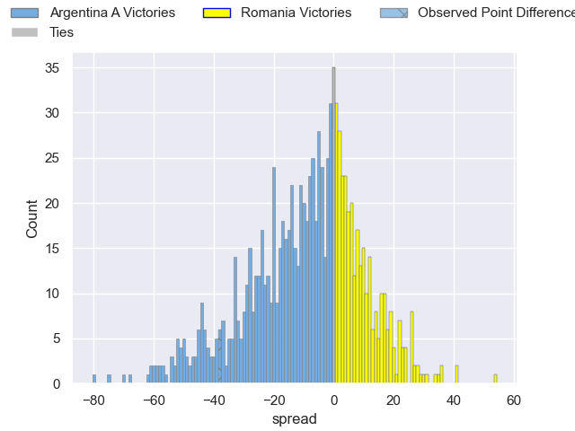
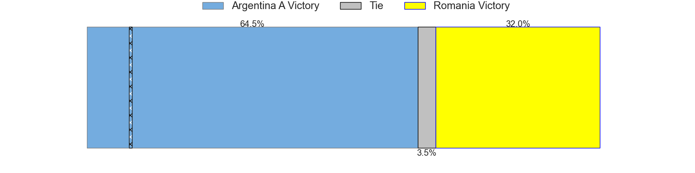

---  
layout: page  
title: Argentina A V Romania on 2025/07/18  
date: 2025-07-18  
categories: "International Test Match 2025" match projection  
---
# Argentina A V Romania on 2025/07/18, 52.0 to 14.0

# Club Level Predictions

Now that the game has been played, lets see how the club predictions did. I predicted Argentina A to win by 9.32, and Argentina A won by 38.0. That's an absolute error of 28.7 for the margin of victory, while my average absolute error has been 13.6 over the past six months. This prediction was more accurate than 9.1% of my recent predictions.

For the Over/Under model, I predicted a total of 56.5 and we have an actual total of 66.0. That's an absolute error of 9.5 compared to a six month average of 13.9. This prediction was more accurate than 56.8% of my recent predictions.
## Projected Performances - Club Model

## Projected Spreads - Club Model

## Projected Results - Club Model

