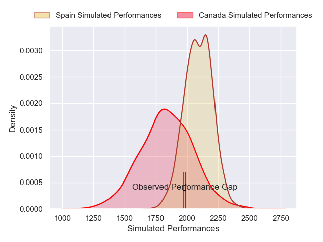

---  
layout: page  
title: Canada V Spain on 2025/07/18  
date: 2025-07-18  
categories: "International Test Match 2025" match projection  
---
# Canada V Spain on 2025/07/18, 23.0 to 24.0

# Club Level Predictions

Now that the game has been played, lets see how the club predictions did. I predicted Spain to win by 6.49, and Spain won by 1.0. That's an absolute error of 5.5 for the margin of victory, while my average absolute error has been 13.6 over the past six months. This prediction was more accurate than 72.6% of my recent predictions.

For the Over/Under model, I predicted a total of 59.5 and we have an actual total of 47.0. That's an absolute error of 12.5 compared to a six month average of 13.9. This prediction was more accurate than 44.4% of my recent predictions.
## Projected Performances - Club Model

## Projected Spreads - Club Model

## Projected Results - Club Model

