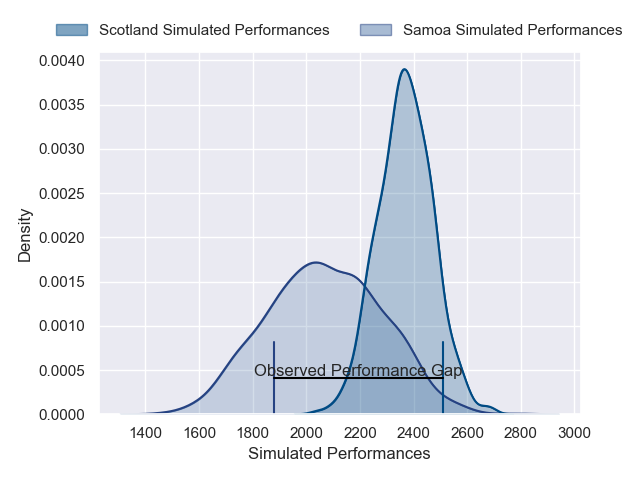
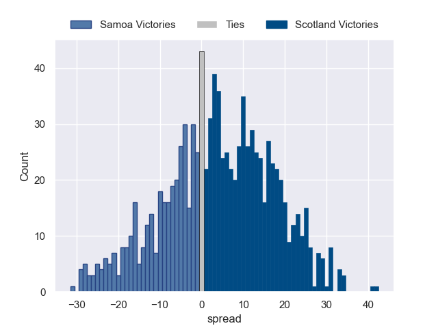

---  
layout: page  
title: Samoa V Scotland on 2025/07/18  
date: 2025-07-18  
categories: "International Test Match 2025" match projection  
---
# Samoa V Scotland on 2025/07/18, 12.0 to 41.0

# Club Level Predictions

Now that the game has been played, lets see how the club predictions did. I predicted Scotland to win by 5.54, and Scotland won by 29.0. That's an absolute error of 23.5 for the margin of victory, while my average absolute error has been 13.7 over the past six months. This prediction was more accurate than 16.2% of my recent predictions.

For the Over/Under model, I predicted a total of 47.5 and we have an actual total of 53.0. That's an absolute error of 5.5 compared to a six month average of 13.9. This prediction was more accurate than 76.2% of my recent predictions.
## Projected Performances - Club Model

## Projected Spreads - Club Model

## Projected Results - Club Model

