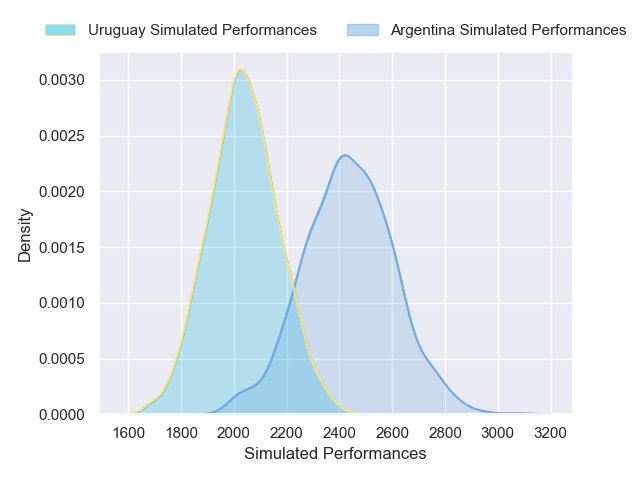
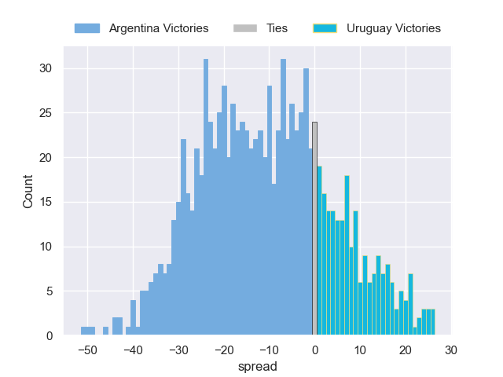

---  
layout: page  
title: Argentina V Uruguay on 2025/07/19  
date: 2025-07-19  
categories: "International Test Match 2025" match projection  
---
# Argentina V Uruguay on 2025/07/19, 52.0 to 17.0

# Club Level Predictions

Now that the game has been played, lets see how the club predictions did. I predicted Argentina to win by 14.84, and Argentina won by 35.0. That's an absolute error of 20.2 for the margin of victory, while my average absolute error has been 13.6 over the past six months. This prediction was more accurate than 21.9% of my recent predictions.

For the Over/Under model, I predicted a total of 60.5 and we have an actual total of 69.0. That's an absolute error of 8.5 compared to a six month average of 13.9. This prediction was more accurate than 61.8% of my recent predictions.
## Projected Performances - Club Model

## Projected Spreads - Club Model

## Projected Results - Club Model

