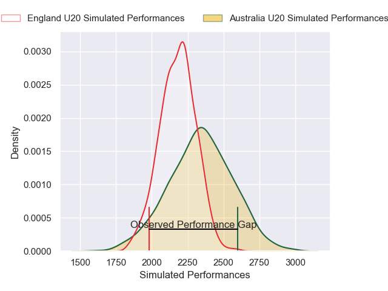
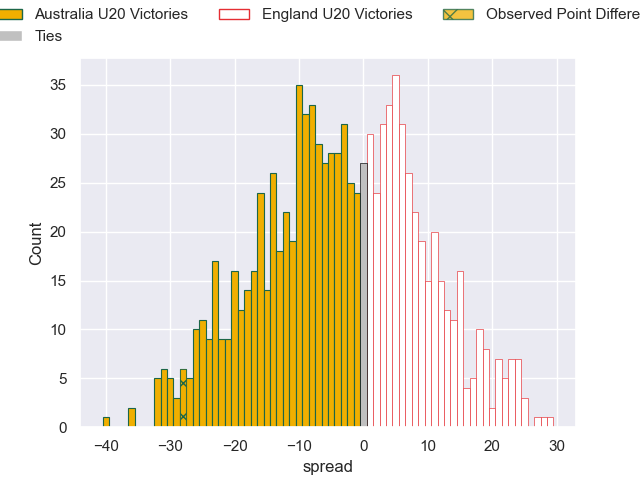

---  
layout: page  
title: Australia U20 V England U20 on 2025/07/19  
date: 2025-07-19  
categories: "U20 Championship 2025" match projection  
---
# Australia U20 V England U20 on 2025/07/19, 68.0 to 40.0

# Club Level Predictions

Now that the game has been played, lets see how the club predictions did. I predicted Australia U20 to win by 3.39, and Australia U20 won by 28.0. That's an absolute error of 24.6 for the margin of victory, while my average absolute error has been 13.6 over the past six months. This prediction was more accurate than 14.4% of my recent predictions.

For the Over/Under model, I predicted a total of 54.5 and we have an actual total of 108.0. That's an absolute error of 53.5 compared to a six month average of 13.9. This prediction was more accurate than 0.7% of my recent predictions.
## Projected Performances - Club Model

## Projected Spreads - Club Model

## Projected Results - Club Model

