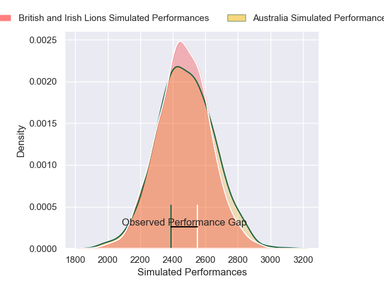
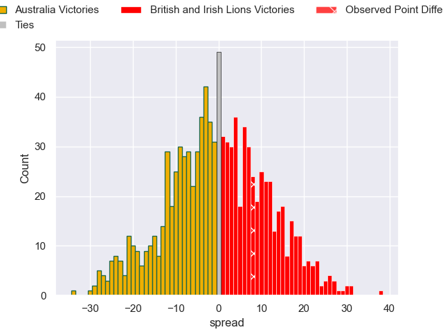

---  
layout: page  
title: Australia V British and Irish Lions on 2025/07/19  
date: 2025-07-19  
categories: "International Test Match 2025" match projection  
---
# Australia V British and Irish Lions on 2025/07/19, 19.0 to 27.0

# Club Level Predictions

Now that the game has been played, lets see how the club predictions did. I predicted Australia to win by 0.16, and British and Irish Lions won by 8.0. That's an absolute error of 8.2 for the margin of victory, while my average absolute error has been 13.6 over the past six months. This prediction was more accurate than 59.2% of my recent predictions.

For the Over/Under model, I predicted a total of 48.5 and we have an actual total of 46.0. That's an absolute error of 2.5 compared to a six month average of 13.9. This prediction was more accurate than 88.7% of my recent predictions.
## Projected Performances - Club Model

## Projected Spreads - Club Model

## Projected Results - Club Model

