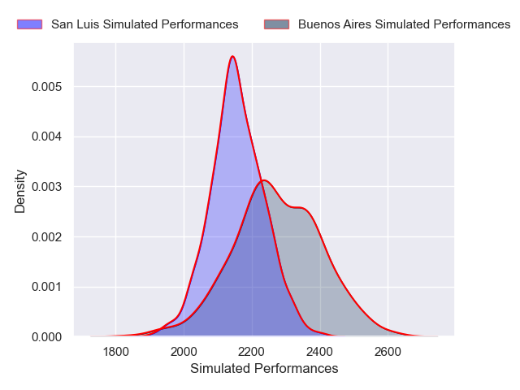
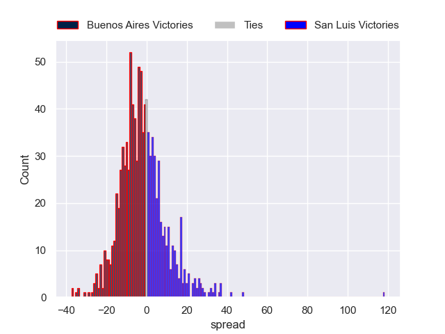

---  
layout: page  
title: Buenos Aires V San Luis on 2025/07/19  
date: 2025-07-19  
categories: "URBA Top 12 2025" match projection  
---
# Buenos Aires V San Luis on 2025/07/19, 26.0 to 18.0

# Club Level Predictions

Now that the game has been played, lets see how the club predictions did. I predicted Buenos Aires to win by 2.9, and Buenos Aires won by 8.0. That's an absolute error of 5.1 for the margin of victory, while my average absolute error has been 13.6 over the past six months. This prediction was more accurate than 73.6% of my recent predictions.

For the Over/Under model, I predicted a total of 49.5 and we have an actual total of 44.0. That's an absolute error of 5.5 compared to a six month average of 13.9. This prediction was more accurate than 76.5% of my recent predictions.
## Projected Performances - Club Model

## Projected Spreads - Club Model

## Projected Results - Club Model

