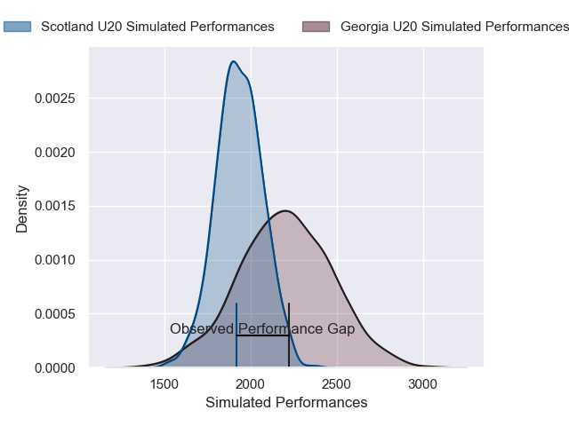

---  
layout: page  
title: Georgia U20 V Scotland U20 on 2025/07/19  
date: 2025-07-19  
categories: "U20 Championship 2025" match projection  
---
# Georgia U20 V Scotland U20 on 2025/07/19, 22.0 to 7.0

# Club Level Predictions

Now that the game has been played, lets see how the club predictions did. I predicted Georgia U20 to win by 7.74, and Georgia U20 won by 15.0. That's an absolute error of 7.3 for the margin of victory, while my average absolute error has been 13.6 over the past six months. This prediction was more accurate than 64.9% of my recent predictions.

For the Over/Under model, I predicted a total of 48.5 and we have an actual total of 29.0. That's an absolute error of 19.5 compared to a six month average of 13.9. This prediction was more accurate than 24.7% of my recent predictions.
## Projected Performances - Club Model

## Projected Spreads - Club Model

## Projected Results - Club Model

