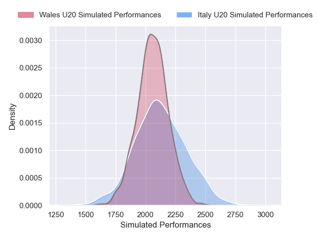
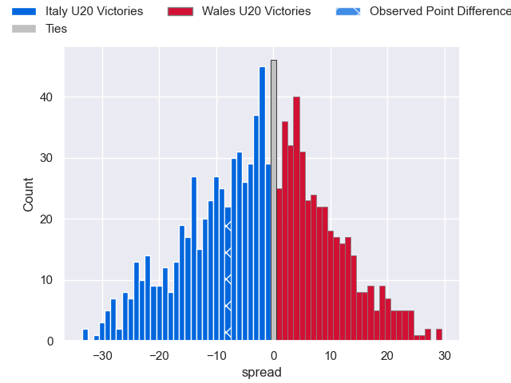

---  
layout: page  
title: Italy U20 V Wales U20 on 2025/07/19  
date: 2025-07-19  
categories: "U20 Championship 2025" match projection  
---
# Italy U20 V Wales U20 on 2025/07/19, 31.0 to 23.0

# Club Level Predictions

Now that the game has been played, lets see how the club predictions did. I predicted Italy U20 to win by 2.37, and Italy U20 won by 8.0. That's an absolute error of 5.6 for the margin of victory, while my average absolute error has been 13.6 over the past six months. This prediction was more accurate than 72.3% of my recent predictions.

For the Over/Under model, I predicted a total of 52.5 and we have an actual total of 54.0. That's an absolute error of 1.5 compared to a six month average of 13.9. This prediction was more accurate than 93.3% of my recent predictions.
## Projected Performances - Club Model

## Projected Spreads - Club Model

## Projected Results - Club Model

