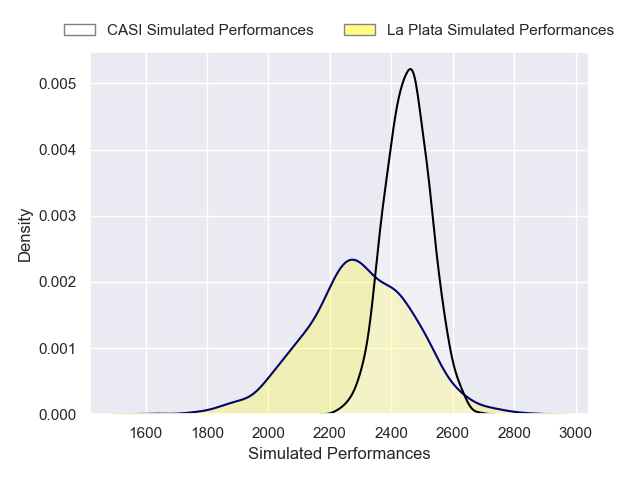
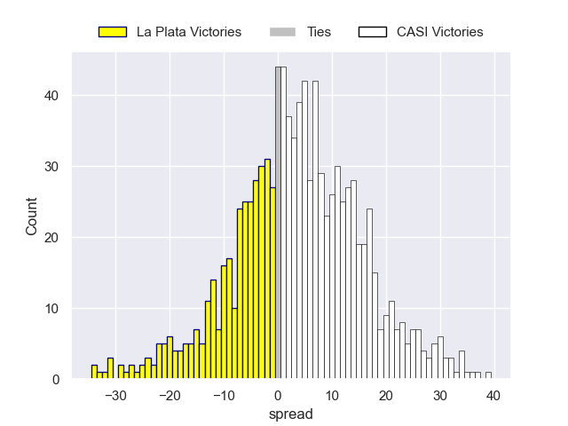
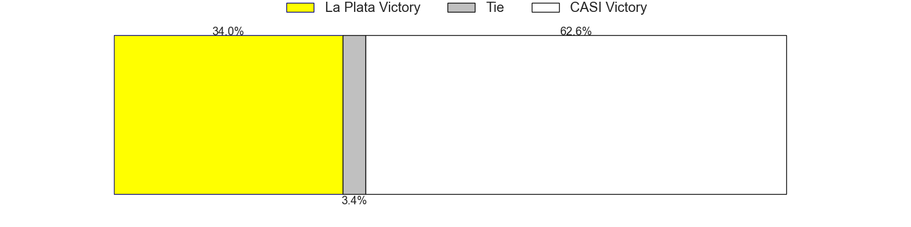

---  
layout: page  
title: La Plata V CASI on 2025/07/19  
date: 2025-07-19  
categories: "URBA Top 12 2025" match projection  
---
# La Plata V CASI on 2025/07/19, 15.0 to 44.0

# Club Level Predictions

Now that the game has been played, lets see how the club predictions did. I predicted CASI to win by 3.82, and CASI won by 29.0. That's an absolute error of 25.2 for the margin of victory, while my average absolute error has been 13.6 over the past six months. This prediction was more accurate than 13.0% of my recent predictions.

For the Over/Under model, I predicted a total of 51.5 and we have an actual total of 59.0. That's an absolute error of 7.5 compared to a six month average of 13.9. This prediction was more accurate than 67.0% of my recent predictions.
## Projected Performances - Club Model

## Projected Spreads - Club Model

## Projected Results - Club Model

