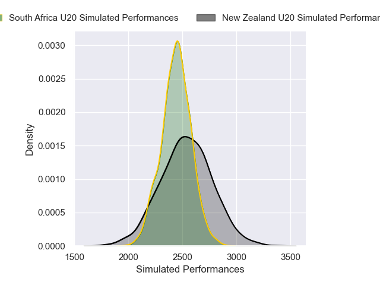
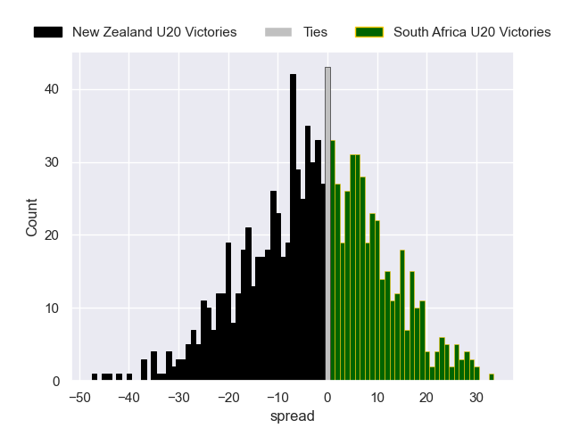

---  
layout: page  
title: New Zealand U20 V South Africa U20 on 2025/07/19  
date: 2025-07-19  
categories: "U20 Championship 2025" match projection  
---
# New Zealand U20 V South Africa U20 on 2025/07/19, 15.0 to 23.0

# Club Level Predictions

Now that the game has been played, lets see how the club predictions did. I predicted New Zealand U20 to win by 1.19, and South Africa U20 won by 8.0. That's an absolute error of 9.2 for the margin of victory, while my average absolute error has been 13.6 over the past six months. This prediction was more accurate than 55.1% of my recent predictions.

For the Over/Under model, I predicted a total of 54.5 and we have an actual total of 38.0. That's an absolute error of 16.5 compared to a six month average of 13.9. This prediction was more accurate than 31.9% of my recent predictions.
## Projected Performances - Club Model

## Projected Spreads - Club Model

## Projected Results - Club Model

