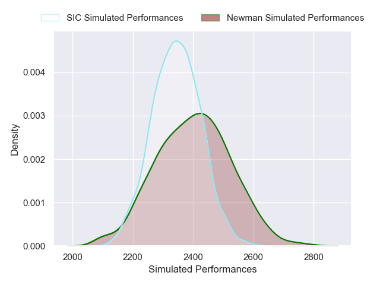
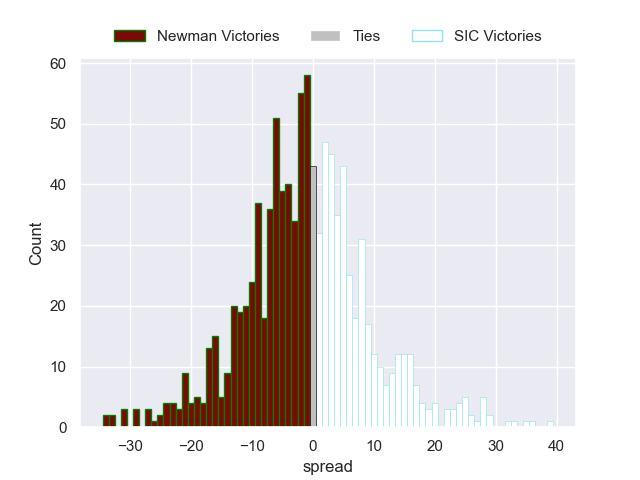

---  
layout: page  
title: Newman V SIC on 2025/07/19  
date: 2025-07-19  
categories: "URBA Top 12 2025" match projection  
---
# Newman V SIC on 2025/07/19, 45.0 to 21.0

# Club Level Predictions

Now that the game has been played, lets see how the club predictions did. I predicted Newman to win by 0.34, and Newman won by 24.0. That's an absolute error of 23.7 for the margin of victory, while my average absolute error has been 13.6 over the past six months. This prediction was more accurate than 15.6% of my recent predictions.

For the Over/Under model, I predicted a total of 47.5 and we have an actual total of 66.0. That's an absolute error of 18.5 compared to a six month average of 13.9. This prediction was more accurate than 26.2% of my recent predictions.
## Projected Performances - Club Model

## Projected Spreads - Club Model

## Projected Results - Club Model

