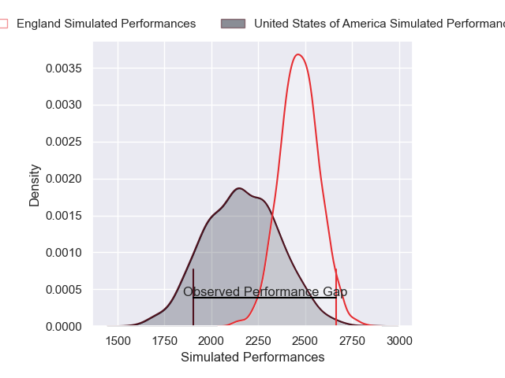
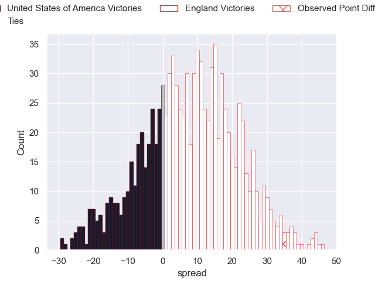

---  
layout: page  
title: United States of America V England on 2025/07/19  
date: 2025-07-19  
categories: "International Test Match 2025" match projection  
---
# United States of America V England on 2025/07/19, 5.0 to 40.0

# Club Level Predictions

Now that the game has been played, lets see how the club predictions did. I predicted England to win by 7.86, and England won by 35.0. That's an absolute error of 27.1 for the margin of victory, while my average absolute error has been 13.6 over the past six months. This prediction was more accurate than 10.6% of my recent predictions.

For the Over/Under model, I predicted a total of 50.5 and we have an actual total of 45.0. That's an absolute error of 5.5 compared to a six month average of 13.9. This prediction was more accurate than 76.5% of my recent predictions.
## Projected Performances - Club Model

## Projected Spreads - Club Model

## Projected Results - Club Model

