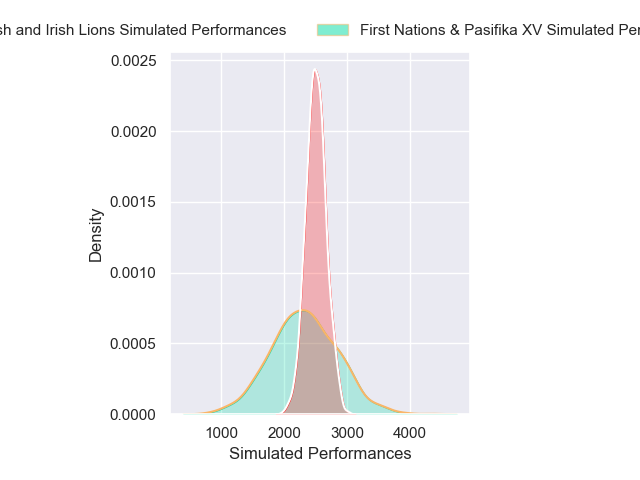
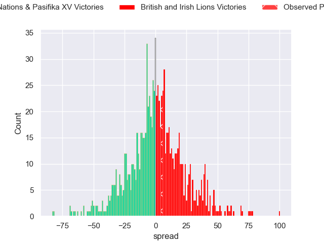

---  
layout: page  
title: First Nations & Pasifika XV V British and Irish Lions on 2025/07/22  
date: 2025-07-22  
categories: "Lions Tour 2025" match projection  
---
# First Nations & Pasifika XV V British and Irish Lions on 2025/07/22, 19.0 to 24.0

# Club Level Predictions

Now that the game has been played, lets see how the club predictions did. I predicted British and Irish Lions to win by 1.04, and British and Irish Lions won by 5.0. That's an absolute error of 4.0 for the margin of victory, while my average absolute error has been 14.2 over the past six months. This prediction was more accurate than 80.7% of my recent predictions.

For the Over/Under model, I predicted a total of 42.5 and we have an actual total of 43.0. That's an absolute error of 0.5 compared to a six month average of 14.1. This prediction was more accurate than 97.1% of my recent predictions.
## Projected Performances - Club Model

## Projected Spreads - Club Model

## Projected Results - Club Model

