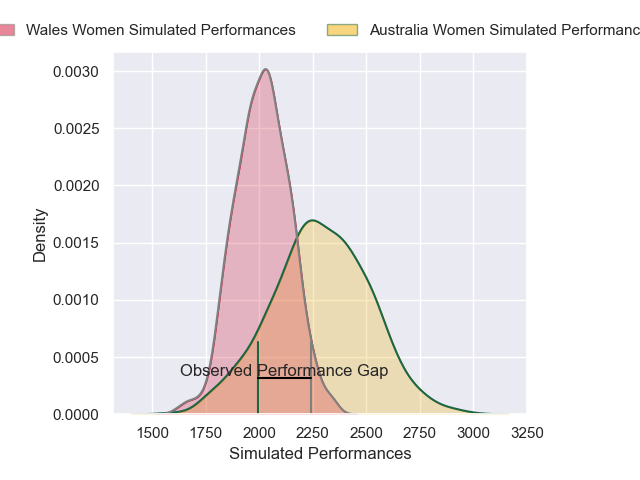
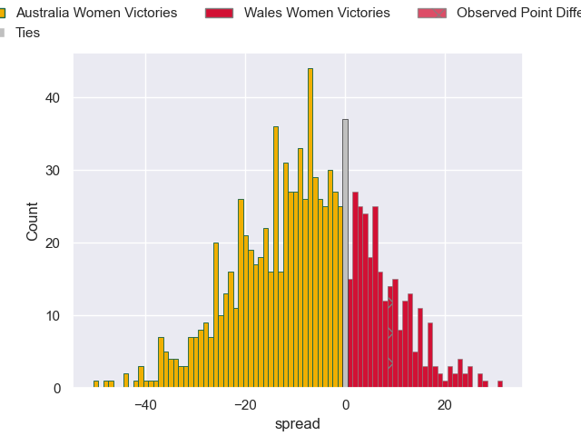

---  
layout: page  
title: Australia Women V Wales Women on 2025/07/25  
date: 2025-07-25  
categories: "Women's International Test Match 2025" match projection  
---
# Australia Women V Wales Women on 2025/07/25, 12.0 to 21.0

# Club Level Predictions

Now that the game has been played, lets see how the club predictions did. I predicted Australia Women to win by 6.36, and Wales Women won by 9.0. That's an absolute error of 15.4 for the margin of victory, while my average absolute error has been 14.2 over the past six months. This prediction was more accurate than 34.8% of my recent predictions.

For the Over/Under model, I predicted a total of 50.5 and we have an actual total of 33.0. That's an absolute error of 17.5 compared to a six month average of 14.1. This prediction was more accurate than 30.7% of my recent predictions.
## Projected Performances - Club Model

## Projected Spreads - Club Model

## Projected Results - Club Model

