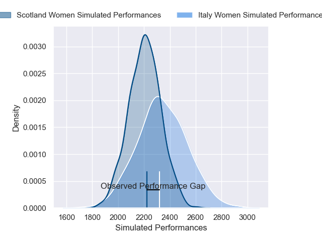
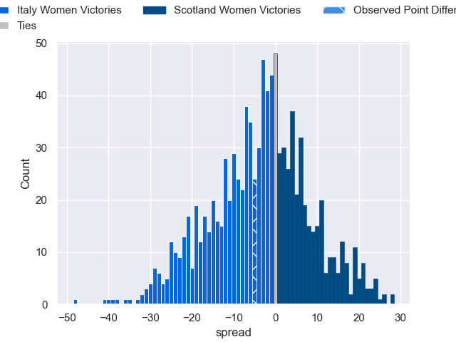

---  
layout: page  
title: Italy Women V Scotland Women on 2025/07/25  
date: 2025-07-25  
categories: "Women's International Test Match 2025" match projection  
---
# Italy Women V Scotland Women on 2025/07/25, 34.0 to 29.0

# Club Level Predictions

Now that the game has been played, lets see how the club predictions did. I predicted Italy Women to win by 3.76, and Italy Women won by 5.0. That's an absolute error of 1.2 for the margin of victory, while my average absolute error has been 14.2 over the past six months. This prediction was more accurate than 94.0% of my recent predictions.

For the Over/Under model, I predicted a total of 48.5 and we have an actual total of 63.0. That's an absolute error of 14.5 compared to a six month average of 13.9. This prediction was more accurate than 38.3% of my recent predictions.
## Projected Performances - Club Model

## Projected Spreads - Club Model

## Projected Results - Club Model

