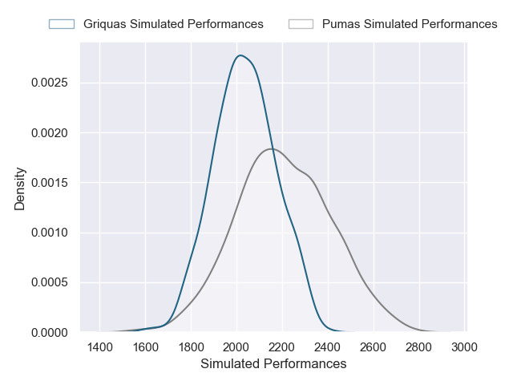
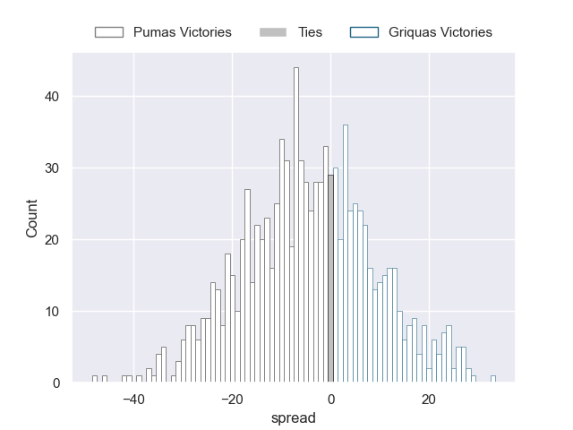

---  
layout: page  
title: Pumas V Griquas on 2025/07/25  
date: 2025-07-25  
categories: "Currie Cup 2025" match projection  
---
# Pumas V Griquas on 2025/07/25, 49.0 to 28.0

# Club Level Predictions

Now that the game has been played, lets see how the club predictions did. I predicted Pumas to win by 3.77, and Pumas won by 21.0. That's an absolute error of 17.2 for the margin of victory, while my average absolute error has been 14.2 over the past six months. This prediction was more accurate than 30.2% of my recent predictions.

For the Over/Under model, I predicted a total of 59.5 and we have an actual total of 77.0. That's an absolute error of 17.5 compared to a six month average of 14.1. This prediction was more accurate than 30.7% of my recent predictions.
## Projected Performances - Club Model

## Projected Spreads - Club Model

## Projected Results - Club Model

