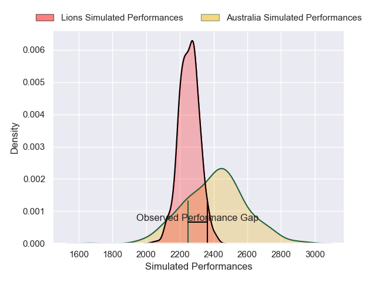
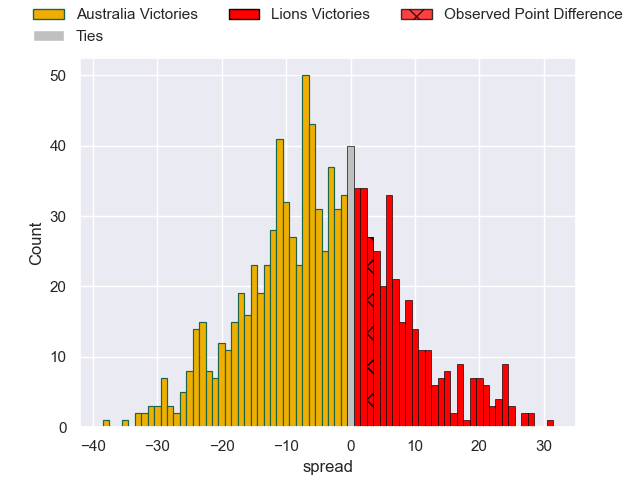
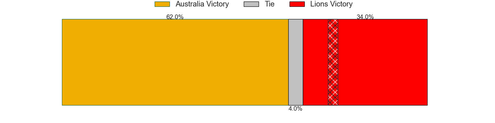

---  
layout: page  
title: Australia V Lions on 2025/07/26  
date: 2025-07-26  
categories: "International Test Match 2025" match projection  
---
# Australia V Lions on 2025/07/26, 26.0 to 29.0

# Club Level Predictions

Now that the game has been played, lets see how the club predictions did. I predicted Australia to win by 3.98, and Lions won by 3.0. That's an absolute error of 7.0 for the margin of victory, while my average absolute error has been 14.2 over the past six months. This prediction was more accurate than 67.0% of my recent predictions.

For the Over/Under model, I predicted a total of 48.5 and we have an actual total of 55.0. That's an absolute error of 6.5 compared to a six month average of 14.1. This prediction was more accurate than 72.0% of my recent predictions.
## Projected Performances - Club Model

## Projected Spreads - Club Model

## Projected Results - Club Model

