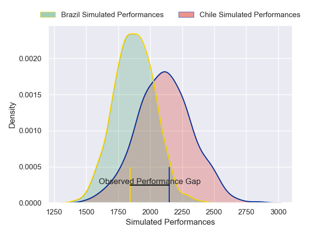
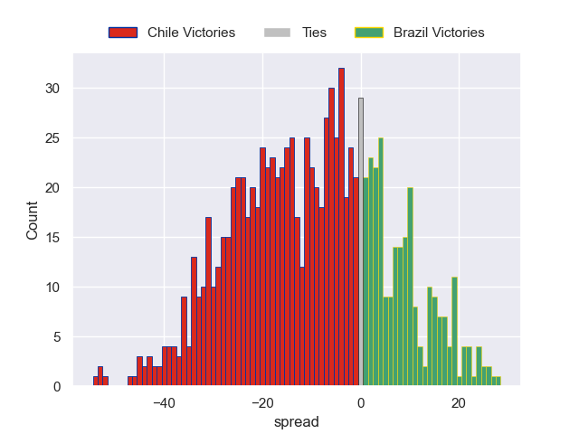

---  
layout: page  
title: Chile V Brazil on 2025/07/26  
date: 2025-07-26  
categories: "International Test Match 2025" match projection  
---
# Chile V Brazil on 2025/07/26, 35.0 to 20.0

# Club Level Predictions

Now that the game has been played, lets see how the club predictions did. I predicted Chile to win by 6.21, and Chile won by 15.0. That's an absolute error of 8.8 for the margin of victory, while my average absolute error has been 14.2 over the past six months. This prediction was more accurate than 57.5% of my recent predictions.

For the Over/Under model, I predicted a total of 50.5 and we have an actual total of 55.0. That's an absolute error of 4.5 compared to a six month average of 13.9. This prediction was more accurate than 80.2% of my recent predictions.
## Projected Performances - Club Model

## Projected Spreads - Club Model

## Projected Results - Club Model

